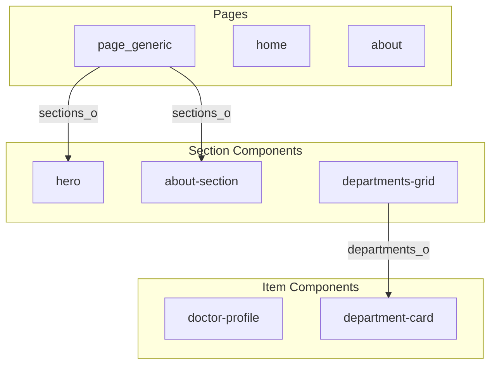

# Skill: Convert HTML Template to CrafterCMS Project (Pages + Components + XB Editing)

This process is referred to as **crafterizing** a template.

## Purpose

Transform a static HTML website template into a functional CrafterCMS project by:

* Breaking pages into reusable components
* Creating content types for pages and components (including nested components)
* Moving static content into content items
* Converting HTML into FreeMarker templates (FTL) with exact structure preservation
* Adding Experience Builder markup so authors can edit content in-context
* Creating content items for every page and component

## Inputs

* A folder (typically `html-template`) containing a static site template:
  * `*.html` files (all pages)
  * `assets/` or `css/`, `js/`, `img/` directories
  * Fonts, images, and other static assets
* Optional: design notes (navigation rules, page variants, component list, content ownership)

## Outputs

A CrafterCMS project with:

* Site config + blueprint-style structure
* Content types in `/config/studio/content-types/` (NOT `/site/content-types/`)
* Templates in `/templates/web/` (pages, components, fragments)
* **Page content items in `/site/website/` (ONE FOR EACH HTML PAGE)**
* **Each page's `sections_o` field populated with component references**
* Shared components in `/site/components/`
* **Nested component items with actual data from HTML**
* **All component collections populated with item references**
* Static assets moved into `/static-assets/`
* Experience Builder (XB) markup across editable regions
* Create a page for each template type

---

## Constraints & Principles

1. **Content-first**: Anything authors should change must be in content (XML) and rendered via FTL
2. **Components over copy-paste**: Repeated blocks become components
3. **Keep HTML structure**: Preserve CSS classes and DOM shape exactly - pixel perfect parity
4. **XB everywhere it matters**: Headings, rich text, images, links, lists, CTA labels/URLs, nav items
5. **Avoid "mega content types"**: Create a small set of page models + modular components
6. **CRITICAL: Create page content items for EVERY HTML page** - don't just create templates
7. **CRITICAL: Populate `sections_o` fields** - pages must reference their components
8. **CRITICAL: Match HTML structure exactly** - preserve all div wrappers, CSS classes, and nesting
9. **CRITICAL: Content types go in `/config/studio/content-types/`** - NOT `/site/content-types/`
10. **CRITICAL: Create content types for ALL components** - including nested components in collections
11. **CRITICAL: Create content items for ALL nested components** - with actual data from HTML
12. **CRITICAL: Populate all component collections** - with item references in correct order

---

## Quick Reference: Critical Checklists

**Use these checklists throughout the crafterization process to prevent common mistakes.**

### Content Type Creation Checklist
- [ ] Create `config.xml` FIRST (before form-definition.xml)
- [ ] Create `form-definition.xml` with all required fields
- [ ] Include `file-name` field (required) in form definition
- [ ] Include `internal-name` field (required) in form definition
- [ ] Add datasources section for image-picker and node-selector fields
- [ ] Verify both files exist before marking content type complete
- [ ] Generate preview image and update `imageThumbnail` property

### Content Item Creation Checklist
- [ ] Root element is correct (`<page>` or `<component>`)
- [ ] `file-name` field exists and matches filename 
- [ ] `internal-name` field exists with human-readable name
- [ ] `objectId` field exists with unique GUID (position after `merge-strategy`)
- [ ] `content-type` field matches content type path exactly
- [ ] `display-template` field matches actual template file (kebab-case)
- [ ] ALL HTML content in `*_html` fields wrapped in CDATA
- [ ] Image paths updated from `images/` to `/static-assets/images/`
- [ ] All required fields from form definition are present
- [ ] `createdDate_dt` and `lastModifiedDate_dt` are set (ISO 8601 format)
- [ ] For pages: `sections_o` field populated with component references
- [ ] For components with collections: Collection fields populated

### Template Creation Checklist
- [ ] Template file uses kebab-case naming
- [ ] Display-template path in form definition matches actual file name
- [ ] HTML structure matches original template exactly (line-by-line comparison)
- [ ] All CSS classes preserved exactly
- [ ] All wrapper divs and containers preserved
- [ ] Image paths updated to `/static-assets/images/`
- [ ] Test template with curl immediately after creation
- [ ] Fix all FreeMarker errors before proceeding

### Component Rendering Checklist
- [ ] Pass node-selector items directly to `@renderComponent` (not loaded SiteItems)
- [ ] For problematic nested components, use direct template inclusion
- [ ] Don't use `@crafter.img` with hyphenated attributes (use regular `` tags)
- [ ] Test component rendering immediately after template creation

### XB Markup Checklist
- [ ] Wrap actual text content, not containers
- [ ] Test XB editing immediately after adding markup
- [ ] Don't wrap icon classes in `@crafter` macros
- [ ] Pass `$model=item` in `#list` loops for nested fields
- [ ] Verify all fields are editable in XB
- [ ] Changes to form defintions must be committed to git before XB can leverage them. 

### OpenSearch Indexing Checklist
- [ ] ALL `*_html` fields wrapped in CDATA in content items
- [ ] Test indexing by committing changes and checking logs
- [ ] Fix any `mapper_parsing_exception` errors immediately
- [ ] Verify pages are searchable after indexing
- [ ] Content is not indexed until it is committed to git. 

---

## Phase 0 — Quick Inventory (Template Triage)

### Step 0.1: Identify page set

* List all `.html` pages and group them by layout similarity
* Detect page "types" based on:
  * Unique hero/banner patterns
  * Sidebar vs full-width
  * Article/blog style vs marketing landing
  * Forms/contact
  * Search/list pages (if any)

**Deliverable**: List of all HTML pages and their page types

### Step 0.2: Identify repeated regions

Across pages, mark these as likely components (adapt to your template):

* Header / Nav
* Footer
* Hero / Banner / Jumbotron
* Feature cards / icon rows / benefit sections
* Testimonials / Reviews
* Pricing tables / Product grids
* FAQ accordion / Q&A sections
* Image galleries / Photo grids
* CTA strips / Call-to-action sections
* Breadcrumbs
* Sidebars / Aside content
* Content blocks / Rich text sections
* Forms (contact, newsletter, etc.)
* Any other repeated HTML blocks

**CRITICAL: Component Categorization**
For each component, categorize it as:
- **Section component** (goes in page `sections_o`) - e.g., hero, about-section, departments-grid
- **Item component** (goes in parent component collections) - e.g., doctor-profile, service-item, testimonial-item
- **Global component** (header, footer, page-title) - used across all pages

**CRITICAL: Component Dependency Map**
Create a dependency map showing:
- Which components contain which item components
- Which pages use which section components
- Parent-child relationships (e.g., `doctors-grid` contains `doctor-profile` items)

**Deliverable**: Component map listing all main components with categories and dependency relationships

### Step 0.3: Identify nested components

**CRITICAL:** Identify components that appear WITHIN other components (e.g., product items in a product grid, feature items in a feature section, testimonial items in a testimonial slider). These need their own content types.

Common nested component patterns:
* Product items in product grids
* Feature items in feature sections
* Testimonial items in testimonial sliders
* Blog post items in blog sections
* Team member items in team sections
* Card items in card grids
* FAQ items in FAQ sections
* Any repeatable items within a parent component

**Deliverable**: List of all nested component types

### Step 0.4: Identify data-like content

Extract content candidates (adapt to your template):

* Site name, logo, brand elements
* Social media links
* Navigation menu items
* Footer link columns
* Global CTA (button label+url)
* Reusable disclaimers / Legal text
* Repeated card/item sets
* Contact information
* Any other content that appears in multiple places

**Deliverable**: Component Map and Page Type Map including nested components

---

## Phase 1 — Crafter Project Skeleton & Asset Migration

### Step 1.1: Create Crafter project structure

Ensure directories exist (typical):

* `/templates/web/` (page templates)
* `/templates/web/pages/` (page templates)
* `/templates/web/components/` (component templates)
* `/templates/web/fragments/` (head, scripts, etc.)
* `/scripts/` (optional helpers)
* `/static-assets/app/` (css/js/fonts)
* `/static-assets/images/` (images)
* `/site/website/` (pages - **ONE FOLDER PER PAGE** the actual page XML content goes in index.xml inside the folder)
* `/site/components/` (shared component items)
* `/config/studio/` (XB configuration if needed)
* `/config/studio/content-types/` (definitions) - CRITICAL: Use this path, NOT /site/content-types/**
* `/.crafter/screenshots/` (site screenshot for Crafter Studio)

### Step 1.2: Move static assets

* Copy CSS/JS/fonts into relevant subfolders of `/static-assets/app/...`
* Copy images into `/static-assets/images/...`
* Copy favicon to `/static-assets/`
* Update paths in templates to use Crafter-friendly URLs, e.g.:
  * `/static-assets/app/css/main.css`
  * `/static-assets/app/js/main.js`
  * `/static-assets/images/branding/logo.svg`

**CRITICAL**: Maintain the same relative path structure within `/static-assets/` as in the original template. If no structure exist, group images logically into sub folders based on use.

### Step 1.3: Create site screenshot

**CRITICAL: Generate a site-specific screenshot for Crafter Studio**

Create a screenshot image that represents your crafterized site:

* **Location**: `/.crafter/screenshots/default.png`
* **Size**: 1920x1080 pixels (standard desktop resolution)
* **Format**: PNG
* **Purpose**: Displayed in Crafter Studio as a preview of the site

#### Screenshot Requirements

The screenshot should:
1. **Represent the site visually** - Show key elements like header, hero section, content sections
2. **Use site branding** - Include site name, colors, and key messaging
3. **Show main features** - Highlight primary services, departments, or content areas
4. **Be professional** - Clean, modern design that represents the site well
5. **Include site ID** - Display the site ID (e.g., "Site ID: clinic") in the bottom-right corner for identification

#### Screenshot Generation Methods

**Option 1: Using ImageMagick (Recommended)**
```bash
convert -size 1920x1080 xc:'#ffffff' \
  -fill '#BRAND_COLOR' -draw 'rectangle 0,0 1920,80' \
  -font DejaVu-Sans-Bold -pointsize 32 -fill white -gravity West -annotate +30+25 'SITE_NAME' \
  -font DejaVu-Sans -pointsize 16 -fill '#LIGHT_COLOR' -gravity East -annotate -30+25 'Navigation Menu Items' \
  -fill '#HERO_COLOR' -draw 'rectangle 0,80 1920,480' \
  -font DejaVu-Sans-Bold -pointsize 56 -fill white -gravity Center -annotate +0+200 'Main Headline' \
  -font DejaVu-Sans -pointsize 24 -fill '#LIGHT_COLOR' -gravity Center -annotate +0+280 'Tagline or Key Message' \
  -fill '#SECTION_COLOR' -draw 'rectangle 50,550 600,900' \
  -font DejaVu-Sans-Bold -pointsize 28 -fill white -gravity NorthWest -annotate +70+580 'Service/Feature 1' \
  -fill '#SECTION_COLOR_2' -draw 'rectangle 630,550 1180,900' \
  -font DejaVu-Sans-Bold -pointsize 28 -fill white -gravity NorthWest -annotate +650+580 'Service/Feature 2' \
  -fill '#SECTION_COLOR_3' -draw 'rectangle 1210,550 1760,900' \
  -font DejaVu-Sans-Bold -pointsize 28 -fill white -gravity NorthWest -annotate +1230+580 'Service/Feature 3' \
  -fill '#FOOTER_COLOR' -draw 'rectangle 0,980 1920,1080' \
  -font DejaVu-Sans -pointsize 16 -fill '#LIGHT_COLOR' -gravity Center -annotate +0+1020 '© 2025 Site Name | Footer Links' \
  -font DejaVu-Sans-Bold -pointsize 14 -fill '#6c757d' -gravity SouthEast -annotate -20-10 'Site ID: SITE_ID' \
  .crafter/screenshots/default.png
```

**Note**: Replace `SITE_ID` with your actual site ID (e.g., "clinic", "my-site", etc.). The site ID is typically the folder name in the CrafterCMS sites directory.
```

**Option 2: Capture from Browser**
1. Open the site in a browser (preview mode)
2. Take a screenshot of the home page
3. Crop/resize to 1920x1080 if needed
4. Save as `/.crafter/screenshots/default.png`

**Option 3: Use Design Tool**
1. Create a mockup in Figma, Photoshop, or similar
2. Export as PNG at 1920x1080 resolution
3. Save to `/.crafter/screenshots/default.png`

#### Screenshot Best Practices

* Use site's actual color scheme and branding
* Include key navigation elements
* Show 2-3 main content sections or features
* Keep text readable and professional
* Match the overall design aesthetic of the site
* **CRITICAL: Include site ID** - Add "Site ID: [your-site-id]" in the bottom-right corner for easy identification in Crafter Studio

**Deliverable:** `/.crafter/screenshots/default.png` - Site-specific screenshot for Crafter Studio

### Step 1.4: Create Sitemap Controller

**CRITICAL: Set up sitemap functionality using Elasticsearch/OpenSearch**

Create a sitemap controller that generates XML sitemaps for search engines. The sitemap uses Elasticsearch wildcard queries to find all pages in `/site/website/` and doesn't require any content model fields. It automatically filters out disabled pages, redirects, and level descriptors.

#### Sitemap Controller Structure

1. **Create controller directory structure:**
   ```
   /scripts/controllers/plugins/org/craftercms/plugin/sitemap/
   ```

2. **Create sitemap controller:**
   - **Location**: `/scripts/controllers/plugins/org/craftercms/plugin/sitemap/sitemap.get.groovy`
   - **Purpose**: Generates XML sitemap following sitemaps.org schema
   - **Uses**: OpenSearch (`searchService`) to find pages with `placeInNav=true` or home page
   - **Output**: XML directly via `response.out.print()` (no template needed)

#### Sitemap Controller Implementation

The controller should:
- Use `elasticsearch.search()` to query for all pages in `/site/website/`
- Filter out disabled pages and pages matching blacklist patterns
- Get `lastModifiedDate_dt` from OpenSearch results (no content model fields needed)
- Use `urlTransformationService.transform()` to build proper URLs
- Generate XML following sitemaps.org schema using `groovy.xml.MarkupBuilder`
- Include default values:
  - `changefreq`: "weekly" (default)
  - `priority`: "0.8000" (default)
- Support configurable blacklist patterns via `siteConfig.getStringArray("siteMap.excludes")`
- Output XML directly via `response.setContentType("application/xml")` and `response.getWriter()`

**Example sitemap controller implementation:**
```groovy
import org.craftercms.engine.service.context.SiteContext
import java.util.regex.Pattern

// Go to search and get all pages that are NOT disabled
def pageItems = queryPages(params.route, elasticsearch)

// get black list patterns
def excludePatterns = getBlackListPatterns(siteConfig)

// Prepare the response
response.setContentType("application/xml")
def xml = new groovy.xml.MarkupBuilder(response.getWriter())

def xmlHelper = new groovy.xml.MarkupBuilderHelper(xml)
xmlHelper.xmlDeclaration(version:"1.0", encoding:"UTF-8")

xml.urlset(xmlns:"http://www.sitemaps.org/schemas/sitemap/0.9") {
    pageItems.each { v ->
        def issue = ""
        // check if the current item is black listed
        def blackListed = false
        excludePatterns.any { patternAsStr ->
            def excludePattern = Pattern.compile(patternAsStr, Pattern.CASE_INSENSITIVE)
            def excludeMatcher = excludePattern.matcher( v.localId )
            blackListed = excludeMatcher.find()

            if(v["content-type"].equals("/page/redirect") ) {
                // do not list redirects as valid URLs    
                blackListed = true
            }
            
            // don't keep searching patterns. A match was found
            if(blackListed) return true
        }

        // if not black listed, add it        
        if(blackListed == false) {
            url {
                SiteContext context = SiteContext.current 

                url = urlTransformationService.transform("storeUrlToRenderUrl", v.localId)
                fullyQualifiedUrl = "$request.scheme://$request.serverName:$request.serverPort$url"
                loc(fullyQualifiedUrl)
                lastmod(v.lastModifiedDate_dt)  
                changefreq("weekly")
                priority(0.8000)
            }
        }
    }
}

response.flushBuffer()

return null

/**
 * get site map blacklist 
 */ 
def getBlackListPatterns(siteConfig) {
    
    // The engine config provides configurable black list
    // This can be used to stop entire classes of URLs from showing on the sitemap
    def excludePatterns = []
    def excludePatternsConfig = siteConfig.getStringArray("siteMap.excludes")
    
    if(!excludePatternsConfig) {
        // if no patterns specified, are excluded assume 
        // that no level descriptors is the default black list
        excludePatterns.add("^.*level[\\.]xml\$")    
    }
    else {
        excludePatterns = excludePatternsConfig
    }
    
    return excludePatterns
}

/**
 * query pages for a given route
 */
def queryPages(route, elasticsearch) {
    def routeFolder = params.route ? params.route : "/"
    def path = '/site/website'+routeFolder+'*'
    def results = elasticsearch.search( 
        [   from: 1, size:1000,
            query: 
            [ bool: 
                [ filter: 
                    [ wildcard: [ 'localId': path ] ] 
                    ] 
                ] 
        ]).hits.hits*.sourceAsMap  
    return results  
}
```

#### URL Rewrite Configuration

3. **Add URL rewrite rule:**
   - **Location**: `/config/engine/urlrewrite.xml`
   - **Rule**: Map `/sitemap.xml` to `/plugins/org/craftercms/plugin/sitemap/sitemap`

**Example urlrewrite.xml entry:**
```xml
<urlrewrite>
    <!-- Sitemap XML -->
    <rule>
        <from>^/sitemap.xml$</from>
        <to>/plugins/org/craftercms/plugin/sitemap/sitemap</to>
    </rule>
</urlrewrite>
```

#### Site Configuration (Optional)

4. **Optional: Configure blacklist patterns:**
   - **Location**: `/config/engine/site-config.xml`
   - **Add**: `<siteMap.excludes>` array to exclude specific URL patterns from sitemap
   - **Default**: Excludes level descriptors (`^.*level[\\.]xml$`) if no patterns specified

**Example site-config.xml entry (optional):**
```xml
<site>
    <version>4.0.1</version>
    
    <!-- Optional: Sitemap exclusion patterns -->
    <siteMap>
        <excludes>
            <value>^.*level[\\.]xml$</value>
            <value>/site/website/r/.*</value>
            <value>/site/website/resources/.*</value>
        </excludes>
    </siteMap>
</site>
```

**Note**: The sitemap controller automatically excludes redirect pages (`/page/redirect` content type) and level descriptors. Additional patterns can be configured via `siteMap.excludes`.

#### Sitemap Features

- **No content model fields required**: Uses OpenSearch/Elasticsearch results directly
- **Automatic page discovery**: Finds all pages in `/site/website/` via wildcard search
- **Blacklist support**: Configurable exclusion patterns via `siteMap.excludes` in site config
- **Automatic filtering**: Excludes redirect pages and level descriptors by default
- **Last modified dates**: Retrieved from OpenSearch index (`lastModifiedDate_dt`)
- **URL transformation**: Uses `urlTransformationService` to build proper render URLs
- **Standard sitemap URL**: Accessible at `/sitemap.xml` via URL rewrite
- **Search engine ready**: Follows sitemaps.org XML schema

#### Access Points

The sitemap will be accessible at:
- **Standard URL**: `http://localhost:8080/sitemap.xml` (via URL rewrite)
- **Direct Plugin URL**: `http://localhost:8080/plugins/org/craftercms/plugin/sitemap/sitemap`

**Deliverable:** 
- Sitemap controller at `/scripts/controllers/plugins/org/craftercms/plugin/sitemap/sitemap.get.groovy`
- URL rewrite rule in `/config/engine/urlrewrite.xml`
- Site URL configuration in `/config/engine/site-config.xml`

### Step 1.5: Create Search Functionality

**CRITICAL: Add search capability to every crafterized site**

Create a REST search API and search page that allows users to search site content using OpenSearch/Elasticsearch. Check the original HTML template for an existing search page - if found, use it as the basis; if not, create a new one.

#### Search Template Check

1. **Check for existing search template:**
   - Look for `search.html`, `search-page.html`, or similar files in the HTML template
   - If found, use it as the basis for the search page template
   - If not found, create a new search page matching the site's design patterns

#### Search REST API Controller

2. **Create REST search controller:**
   - **Location**: `/scripts/rest/1/search.get.groovy`
   - **Purpose**: Provides JSON API for keyword search of page content
   - **Uses**: OpenSearch multi-match query across title, body, description, navLabel
   - **Output**: Return Groovy map/object (automatically marshaled to JSON by CrafterCMS)

**CRITICAL: REST API Directory Structure**
- REST scripts must match the API path structure
- API path `/api/1/search.json` requires script at `/scripts/rest/1/search.get.groovy`
- The version number (`1`) in the URL must match the directory structure (`/scripts/rest/1/`)

#### Search API Implementation

The controller should:
- Accept query parameters: `q` or `query` (required), `page` (optional, default: 1), `pageSize` (optional, default: 10)
- Use `elasticsearch.search()` with multi-match query across:
  - `title_t` (boosted 3x)
  - `internal-name` (boosted 2x)
  - `body_html`
  - `description_html`
  - `navLabel`
- Include highlighting for matched terms
- Filter disabled pages, redirects, and level descriptors
- Return Groovy map/object with:
  - `query`, `page`, `pageSize`, `total`, `totalPages`
  - `hasNextPage`, `hasPreviousPage`
  - `results` array with `title`, `url`, `localId`, `contentType`, `highlights`, `snippet`
- **CRITICAL**: Return Groovy map directly (CrafterCMS auto-marshals to JSON) - do NOT use `response.getWriter().print()` or `JsonBuilder`
- Use `hit.sourceAsMap` to access source data (NOT `hit.source` which returns BytesArray)
- Use `hit.getHighlightFields()` to access highlights (NOT `hit.highlight`)

**Example search API controller:**
```groovy
import java.util.regex.Pattern

// Get search query parameter
def query = params.q ?: params.query ?: ""
def page = params.page ? Integer.parseInt(params.page) : 1
def pageSize = params.pageSize ? Integer.parseInt(params.pageSize) : 10
def offset = (page - 1) * pageSize

if (!query || query.trim().isEmpty()) {
    return [error: "Query parameter 'q' or 'query' is required"]
}

// Get blacklist patterns
def excludePatterns = getBlackListPatterns(siteConfig)

try {
    // Build OpenSearch query
    def searchQuery = [
        from: offset,
        size: pageSize,
        query: [
            bool: [
                must: [[
                    multi_match: [
                        query: query,
                        fields: [
                            "title_t^3",
                            "internal-name^2",
                            "body_html",
                            "description_html",
                            "navLabel",
                            "seoDescription_t"
                        ],
                        type: "best_fields",
                        fuzziness: "AUTO"
                    ]
                ]],
                filter: [
                    [ wildcard: [ localId: "/site/website/*" ] ],
                    [ prefix: [ "content-type": "/page/" ] ]
                ],
                must_not: [
                    [ term: [ disabled: true ] ],
                    [ term: [ "content-type": "/page/redirect" ] ]
                ]
            ]
        ],
        highlight: [
            fields: [
                "title_t": [:],
                "seoDescription_t": [
                    fragment_size: 150,
                    number_of_fragments: 1
                ]
            ]
        ]
    ]
    
    // Execute search
    def searchResult = elasticsearch.search(searchQuery)
    
    def results = []
    def total = 0
    
    if (searchResult && searchResult.hits && searchResult.hits.hits) {
        // Get total count
        try {
            def totalHits = searchResult.hits.total
            if (totalHits != null) {
                try {
                    total = totalHits.getValue() ?: 0
                } catch (Exception e1) {
                    try {
                        total = totalHits.value ?: 0
                    } catch (Exception e2) {
                        total = searchResult.hits.hits?.size() ?: 0
                    }
                }
            } else {
                total = searchResult.hits.hits?.size() ?: 0
            }
        } catch (Exception e) {
            total = searchResult.hits.hits?.size() ?: 0
        }
        
        // Process results
        searchResult.hits.hits.each { hit ->
            def source = hit.sourceAsMap
            if (!source) return
            
            def localId = source.localId
            
            // Check if blacklisted
            def blackListed = false
            excludePatterns.any { patternAsStr ->
                def excludePattern = Pattern.compile(patternAsStr, Pattern.CASE_INSENSITIVE)
                def excludeMatcher = excludePattern.matcher(localId)
                blackListed = excludeMatcher.find()
                if (blackListed) return true
            }
            
            if (!blackListed) {
                def item = [:]
                item.title = source.title_t ?: source["internal-name"] ?: "Untitled"
                item.url = urlTransformationService.transform("storeUrlToRenderUrl", localId)
                item.localId = localId
                item.contentType = source["content-type"]
                
                // Get highlights
                try {
                    def highlightFields = hit.getHighlightFields()
                    if (highlightFields && !highlightFields.isEmpty()) {
                        item.highlights = []
                        highlightFields.each { fieldName, highlightField ->
                            if (highlightField && highlightField.getFragments()) {
                                highlightField.getFragments().each { fragment ->
                                    item.highlights.add(fragment.string())
                                }
                            }
                        }
                    }
                } catch (Exception e) {
                    // Continue without highlights
                }
                
                // Get snippet if no highlights
                if (!item.highlights || item.highlights.isEmpty()) {
                    def body = source.body_html ?: source.seoDescription_t ?: ""
                    if (body) {
                        def plainText = body.replaceAll("<[^>]+>", " ").replaceAll("\\s+", " ").trim()
                        if (plainText.length() > 200) {
                            plainText = plainText.substring(0, 200) + "..."
                        }
                        item.snippet = plainText
                    }
                }
                
                results.add(item)
            }
        }
    }
    
    // Calculate pagination
    def totalPages = (int) Math.ceil(total / pageSize)
    
    // Return Groovy map (automatically marshaled to JSON by CrafterCMS)
    return [
        query: query,
        page: page,
        pageSize: pageSize,
        total: total,
        totalPages: totalPages,
        hasNextPage: page < totalPages,
        hasPreviousPage: page > 1,
        results: results
    ]
    
} catch (Exception e) {
    return [error: "Search error: ${e.message}"]
}

/**
 * get site map blacklist
 */ 
def getBlackListPatterns(siteConfig) {
    def excludePatterns = []
    def excludePatternsConfig = siteConfig.getStringArray("siteMap.excludes")
    
    if(!excludePatternsConfig) {
        excludePatterns.add("^.*level[\\.]xml\$")
    }
    else {
        excludePatterns = excludePatternsConfig
    }
    
    return excludePatterns
}
```

#### Search Page Content Type

3. **Create search page content type:**
   - **Location**: `/config/studio/content-types/page/search/`
   - **Fields**: Basic page properties (title, SEO fields)
   - **Template**: `/templates/web/pages/search.ftl`

#### Search Page Template

4. **Create search page template:**
   - **Location**: `/templates/web/pages/search.ftl`
   - **Features**:
     - Search form with styled input matching site design
     - JavaScript to call REST API at `/api/1/search.json`
     - Results display with highlights and snippets
     - Pagination controls
     - Loading states and error handling
     - Auto-search on page load if query parameter present

**CRITICAL: FreeMarker Template Literals**
- **NEVER use JavaScript template literals (backticks with `${}`) in FTL templates**
- FreeMarker will try to parse `${}` as FreeMarker syntax
- Use string concatenation instead: `'text' + variable + 'more text'`

**Example search page template structure:**
```ftl
<#import "/templates/system/common/crafter.ftl" as crafter />

<!DOCTYPE html>
<html lang="en">
<head>
  <#include "/templates/web/fragments/head.ftl">
  <@crafter.head/>
</head>
<body class="search-page">
<@crafter.body_top/>

<!-- Header -->
<!-- ... header rendering ... -->

<main class="main">
  <!-- Page Title -->
  <div class="page-title">
    <@crafter.h1 $field="title_t">${contentModel.title_t!"Search"}</@crafter.h1>
  </div>

  <!-- Search Form -->
  <section class="search-form-section">
    <form class="search-form" id="searchForm" onsubmit="performSearch(event)">
      <div class="search-input-group">
        <input type="text" id="searchQuery" name="q" 
               placeholder="Search..." 
               value="${RequestParameters.q!''}">
        <button type="submit">Search</button>
      </div>
    </form>
  </section>

  <!-- Search Results -->
  <section class="search-results-section">
    <div id="searchResults">
      <!-- Results populated by JavaScript -->
    </div>
  </section>
</main>

<!-- Footer -->
<!-- ... footer rendering ... -->

<script>
// Use string concatenation, NOT template literals
function executeSearch(query, page) {
  const urlParams = new URLSearchParams(window.location.search);
  const crafterSite = urlParams.get('crafterSite') || '';
  const url = '/api/1/search.json?q=' + encodeURIComponent(query) + 
              '&page=' + page + '&pageSize=10' + 
              (crafterSite ? '&crafterSite=' + encodeURIComponent(crafterSite) : '');
  
  fetch(url)
    .then(response => response.json())
    .then(data => displayResults(data))
    .catch(error => console.error('Search error:', error));
}

// Display results using string concatenation
function displayResults(data) {
  let html = '';
  data.results.forEach(result => {
    html += '<div class="search-result-item">';
    html += '<h3><a href="' + escapeHtml(result.url) + '">' + 
            escapeHtml(result.title) + '</a></h3>';
    html += '<div class="snippet">' + (result.highlights[0] || result.snippet || '') + '</div>';
    html += '</div>';
  });
  document.getElementById('searchResults').innerHTML = html;
}
</script>

<@crafter.body_bottom/>
</body>
</html>
```

#### Search Page Content Item

5. **Create search page content item:**
   - **Location**: `/site/website/search/index.xml`
   - **Content Type**: `/page/search`
   - **URL**: `/search`
   - **Fields**: Title, SEO fields

#### Search API Features

- **Multi-field search**: Searches across title, body, description, navLabel
- **Field boosting**: Title matches weighted 3x, internal-name 2x
- **Highlighting**: Returns highlighted snippets with `<em>` tags
- **Pagination**: Supports page and pageSize parameters
- **Filtering**: Excludes disabled pages, redirects, level descriptors
- **Error handling**: Returns proper error messages for invalid queries
- **URL transformation**: Uses `urlTransformationService` for proper URLs

#### Search API Endpoint

**URL**: `/api/1/search.json`

**Parameters:**
- `q` or `query` (required): Search query
- `page` (optional): Page number (default: 1)
- `pageSize` (optional): Results per page (default: 10)
- `crafterSite` (optional): Site name for multi-site setups

**Response Format:**
```json
{
  "query": "doctor",
  "page": 1,
  "pageSize": 10,
  "total": 5,
  "totalPages": 1,
  "hasNextPage": false,
  "hasPreviousPage": false,
  "results": [
    {
      "title": "Doctors",
      "url": "/doctors",
      "localId": "/site/website/doctors/index.xml",
      "contentType": "/page/page_generic",
      "highlights": ["<em>Doctor</em> profiles..."],
      "snippet": "..."
    }
  ]
}
```

**Deliverable:**
- REST search controller at `/scripts/rest/search.get.groovy`
- Search page content type at `/config/studio/content-types/page/search/`
- Search page template at `/templates/web/pages/search.ftl`
- Search page content item at `/site/website/search/index.xml`

#### Header Search Integration (Optional but Recommended)

6. **Integrate search into header/navigation:**
   - **Location**: Add search toggle and search box to header component template
   - **Purpose**: Allow users to search directly from any page without navigating to search page
   - **Implementation**: Add search toggle button and dropdown search box to header template

**CRITICAL: CSS Structure for Responsive Features**
- **Base styles MUST be outside media queries** - All base styles (positioning, colors, transitions) should apply to all screen sizes
- **Only responsive overrides go inside media queries** - Media queries should only contain size/spacing adjustments
- **Use very specific class names** - When adding new features to existing components, use prefixed class names (e.g., `header-search-*`) to avoid CSS conflicts
- **Don't wrap existing components** - Avoid wrapping existing components in new containers that break CSS selectors

**Example header search integration:**
```ftl
<!-- In header.ftl, after navmenu -->
<div class="header-search-wrapper">
  <button type="button" class="header-search-toggle" id="headerSearchToggle">
    <i class="bi bi-search"></i>
  </button>
  <div class="header-search-box" id="headerSearchBox">
    <form onsubmit="handleHeaderSearch(event)">
      <input type="text" id="headerSearchQuery" name="q" placeholder="Search...">
      <button type="submit">Search</button>
    </form>
  </div>
</div>
```

**CSS Structure Pattern:**
```css
/* Base styles - OUTSIDE media queries (apply to all screen sizes) */
.header-search-wrapper {
  position: relative;
  display: flex;
  align-items: center;
}

.header-search-toggle {
  background: none;
  border: none;
  color: var(--nav-color);
  font-size: 20px;
  cursor: pointer;
  padding: 8px;
}

.header-search-box {
  position: absolute;
  top: 100%;
  right: 0;
  background: #ffffff;
  padding: 15px;
  min-width: 300px;
  opacity: 0;
  visibility: hidden;
  transition: all 0.3s ease;
}

/* Desktop override - INSIDE media query (only size adjustments) */
@media (min-width: 1200px) {
  .header-search-wrapper {
    margin-left: 20px;
  }
}

/* Mobile overrides - INSIDE media query (only size/spacing adjustments) */
@media (max-width: 1199px) {
  .header-search-wrapper {
    margin-left: 0;
  }
  
  .header-search-toggle {
    font-size: 18px;
    padding: 6px;
  }
  
  .header-search-box {
    min-width: 280px;
    max-width: calc(100vw - 40px);
  }
}
```

**JavaScript for Header Search:**
```javascript
// Toggle search box
const headerSearchToggle = document.getElementById('headerSearchToggle');
const headerSearchBox = document.getElementById('headerSearchBox');

if (headerSearchToggle && headerSearchBox) {
  headerSearchToggle.addEventListener('click', function(e) {
    e.stopPropagation();
    headerSearchBox.classList.toggle('active');
    if (headerSearchBox.classList.contains('active')) {
      document.getElementById('headerSearchQuery').focus();
    }
  });

  // Close on outside click
  document.addEventListener('click', function(e) {
    if (!headerSearchBox.contains(e.target) && !headerSearchToggle.contains(e.target)) {
      headerSearchBox.classList.remove('active');
    }
  });

  // Close on Escape key
  document.addEventListener('keydown', function(e) {
    if (e.key === 'Escape' && headerSearchBox.classList.contains('active')) {
      headerSearchBox.classList.remove('active');
    }
  });
}

// Form submission handler
function handleHeaderSearch(event) {
  event.preventDefault();
  const query = document.getElementById('headerSearchQuery').value.trim();
  if (!query) return;
  
  const urlParams = new URLSearchParams(window.location.search);
  const crafterSite = urlParams.get('crafterSite') || '';
  let searchUrl = '/search?q=' + encodeURIComponent(query);
  if (crafterSite) {
    searchUrl += '&crafterSite=' + encodeURIComponent(crafterSite);
  }
  window.location.href = searchUrl;
}

// Make function globally available
window.handleHeaderSearch = handleHeaderSearch;
```

**Best Practices for Adding Features to Existing Components:**
1. **Use specific class prefixes** - Prefix all new classes (e.g., `header-search-*`) to avoid conflicts
2. **Keep base styles global** - Define base styles outside media queries so they work everywhere
3. **Only override in media queries** - Media queries should only adjust sizing, spacing, positioning
4. **Don't modify existing structure** - Add new elements as siblings, not by wrapping existing ones
5. **Test across all breakpoints** - Verify the feature works on desktop, tablet, and mobile
6. **Preserve original functionality** - Ensure new features don't break existing dropdowns, navigation, etc.

---

## Phase 2 — Content Modeling (Pages + Components)

### Step 2.1: Define page content types

**CRITICAL: Content types MUST be created under `/config/studio/content-types/`**

Create 2–5 page types that cover each unique html file in the template:

**EXAMPLE:**
* **Generic Page**
  * title
  * slug/url
  * SEO fields (Seo Keywords, SEO Description)
  * `disabled_b` defaulted to false
  * `sections_o` (repeating component references)
  * `header_o` (optional override)
  * `footer_o` (optional override)
* **Home Page**
  * same as generic + hero variant fields if needed
* **Article/Blog Page** (if template has it)
  * title, date, author, body (rich text), categories
* **Landing Page** (optional)
  * campaign fields, special hero layout, sections

**Strong default pattern:** pages render a list of sections, each section is a component content item.

**CRITICAL:** For each page type:
1. Create `/config/studio/content-types/page/[page-type]/config.xml`
2. Create `/config/studio/content-types/page/[page-type]/form-definition.xml`
3. Ensure `sections_o` field is defined as a node-selector with appropriate contentTypes
4. **CRITICAL: Content Type Naming** - Use consistent naming: `/page/[name]` (e.g., `/page/page_generic`, `/page/home`)
   - Use kebab-case for directory names
   - Use snake_case for content type names in config.xml
   - **Before creating**: Check if a similar content type already exists to avoid duplicates
   - **Never create duplicate directories** that reference the same content type

#### config.xml Format

**CRITICAL**: Use attributes on the root element, NOT nested elements.

```xml
<?xml version="1.0" encoding="UTF-8"?>
<content-type name="/page/page_generic" is-wcm-type="true">
  <label>Generic Page</label>
  <description>Standard page template</description>
	<file-extension>xml</file-extension>
	<content-as-folder>true</content-as-folder>
	<previewable>true</previewable>
	<quickCreate>false</quickCreate>
	<quickCreatePath></quickCreatePath>
	<noThumbnail>true</noThumbnail>
	<image-thumbnail>image.jpg</image-thumbnail>
	<paths>
		<excludes>
			<pattern>^/site/components.*</pattern>
		</excludes>
	</paths>  
</content-type>
```

**Common Mistake**: Do NOT use `<content-type><id>...</id></content-type>` format.
* Page type should have content-as-folder set to true. Component types should set content-as-folder to false
* Page types should set paths/excludes/pattern to ^/site/components.*
* Component types should set paths/excludes/pattern to ^/site/website.*

#### form-definition.xml Format

**Required Root Elements** (in order):
1. `<title>` - Display title
2. `<description>` - Description
3. `<objectType>` - Object type (usually "page" or "component")
4. `<content-type>` - Content type path (matches config.xml name)
5. `<imageThumbnail>` - Optional thumbnail path
6. `<quickCreate>` - Boolean (true/false)
7. `<quickCreatePath>` - Path for quick creation
8. `<properties>` - Required section with:
   - `display-template` - Path to FTL template (use kebab-case, e.g., `/templates/web/pages/generic.ftl`)
   - `no-template-required` - Boolean
   - `merge-strategy` - Merge strategy value
9. `<sections><section>` - Wrap all fields in sections
10. `<datasources>` - Required for image-picker and node-selector fields (see below)

section `defaultOpen` elements should always be set to true.

Example form defintion:
```xml
<form>
	<title>Home</title>
	<description></description>
	<objectType>page</objectType>
	<content-type>/page/home</content-type>
	<imageThumbnail>page-home.png</imageThumbnail>
	<quickCreate>false</quickCreate>
	<quickCreatePath></quickCreatePath>
	<properties>
		<property>
			<name>display-template</name>
			<label>Display Template</label>
			<value>/templates/web/pages/home.ftl</value>
			<type>template</type>
		</property>
		<property>
			<name>no-template-required</name>
			<label>No Template Required</label>
			<value></value>
			<type>boolean</type>
		</property>
		<property>
			<name>merge-strategy</name>
			<label>Merge Strategy</label>
			<value>inherit-levels</value>
			<type>string</type>
		</property>
	</properties>
	<sections>
		<section>
			<title>Page Properties</title>
			<description></description>
			<defaultOpen>true</defaultOpen>
			<fields>
				<field>
					<type>file-name</type>
					<id>file-name</id>
					<iceId></iceId>
					<title>Page URL</title>
					<description></description>
					<defaultValue></defaultValue>
					<help></help>
					<properties>
						<property>
							<name>size</name>
							<value>50</value>
							<type>int</type>
						</property>
						<property>
							<name>maxlength</name>
							<value>50</value>
							<type>int</type>
						</property>
						<property>
							<name>readonly</name>
							<value>true</value>
							<type>boolean</type>
						</property>
					</properties>
					<constraints>
					</constraints>
				</field>
				<field>
					<type>input</type>
					<id>internal-name</id>
					<iceId></iceId>
					<title>Internal Name</title>
					<description></description>
					<defaultValue></defaultValue>
					<help></help>
					<properties>
						<property>
							<name>size</name>
							<value>50</value>
							<type>int</type>
						</property>
						<property>
							<name>maxlength</name>
							<value>50</value>
							<type>int</type>
						</property>
					</properties>
					<constraints>
						<constraint>
							<name>required</name>
							<value><![CDATA[true]]></value>
							<type>boolean</type>
						</constraint>
					</constraints>
				</field>
				<field>
					<type>input</type>
					<id>navLabel</id>
					<iceId></iceId>
					<title>Nav Label</title>
					<description></description>
					<defaultValue></defaultValue>
					<help></help>
					<properties>
						<property>
							<name>size</name>
							<value>50</value>
							<type>int</type>
						</property>
						<property>
							<name>maxlength</name>
							<value>50</value>
							<type>int</type>
						</property>
						<property>
							<name>readonly</name>
							<value></value>
							<type>boolean</type>
						</property>
						<property>
							<name>tokenize</name>
							<value>false</value>
							<type>boolean</type>
						</property>
						<property>
							<name>escapeContent</name>
							<value>false</value>
							<type>boolean</type>
						</property>
					</properties>
					<constraints>
						<constraint>
							<name>required</name>
							<value><![CDATA[]]></value>
							<type>boolean</type>
						</constraint>
						<constraint>
							<name>pattern</name>
							<value><![CDATA[]]></value>
							<type>string</type>
						</constraint>
					</constraints>
				</field>
				<field>
					<type>checkbox</type>
					<id>disabled</id>
					<iceId></iceId>
					<title>Disable Page</title>
					<description></description>
					<defaultValue></defaultValue>
					<help></help>
					<properties>
						<property>
							<name>readonly</name>
							<value></value>
							<type>boolean</type>
						</property>
					</properties>
					<constraints>
						<constraint>
							<name>required</name>
							<value><![CDATA[]]></value>
							<type>boolean</type>
						</constraint>
					</constraints>
				</field>
				<field>
					<type>input</type>
					<id>title_t</id>
					<iceId>core</iceId>
					<title>Title</title>
					<description></description>
					<defaultValue></defaultValue>
					<help></help>
					<properties>
						<property>
							<name>size</name>
							<value>50</value>
							<type>int</type>
						</property>
						<property>
							<name>maxlength</name>
							<value>50</value>
							<type>int</type>
						</property>
						<property>
							<name>readonly</name>
							<value></value>
							<type>boolean</type>
						</property>
						<property>
							<name>tokenize</name>
							<value>false</value>
							<type>boolean</type>
						</property>
					</properties>
					<constraints>
						<constraint>
							<name>required</name>
							<value><![CDATA[true]]></value>
							<type>boolean</type>
						</constraint>
						<constraint>
							<name>pattern</name>
							<value><![CDATA[]]></value>
							<type>string</type>
						</constraint>
					</constraints>
				</field>
				<field>
					<type>node-selector</type>
					<id>header_o</id>
					<iceId>core</iceId>
					<title>Header</title>
					<description>Default header is inherited from Section Defaults. Specify a new header to overwrite it.</description>
					<defaultValue></defaultValue>
					<help></help>
					<properties>
						<property>
							<name>minSize</name>
							<value>0</value>
							<type>int</type>
						</property>
						<property>
							<name>maxSize</name>
							<value>1</value>
							<type>int</type>
						</property>
						<property>
							<name>itemManager</name>
							<value>components-header</value>
							<type>datasource:item</type>
						</property>
						<property>
							<name>readonly</name>
							<value></value>
							<type>boolean</type>
						</property>
						<property>
							<name>disableFlattening</name>
							<value></value>
							<type>boolean</type>
						</property>
						<property>
							<name>useSingleValueFilename</name>
							<value></value>
							<type>boolean</type>
						</property>
						<property>
							<name>contentTypes</name>
							<value>/component/header</value>
							<type>contentTypes</type>
						</property>
						<property>
							<name>tags</name>
							<value></value>
							<type>string</type>
						</property>
					</properties>
					<constraints>
						<constraint>
							<name>allowDuplicates</name>
							<value><![CDATA[]]></value>
							<type>boolean</type>
						</constraint>
					</constraints>
				</field>
				<field>
					<type>node-selector</type>
					<id>left_rail_o</id>
					<iceId></iceId>
					<title>Left Rail</title>
					<description>Default left-rail is inherited from Section Defaults. Specify a new left-rail to overwrite it.</description>
					<defaultValue></defaultValue>
					<help></help>
					<properties>
						<property>
							<name>minSize</name>
							<value>0</value>
							<type>int</type>
						</property>
						<property>
							<name>maxSize</name>
							<value>1</value>
							<type>int</type>
						</property>
						<property>
							<name>itemManager</name>
							<value>components-left-rail</value>
							<type>datasource:item</type>
						</property>
						<property>
							<name>readonly</name>
							<value></value>
							<type>boolean</type>
						</property>
						<property>
							<name>disableFlattening</name>
							<value></value>
							<type>boolean</type>
						</property>
						<property>
							<name>useSingleValueFilename</name>
							<value></value>
							<type>boolean</type>
						</property>
						<property>
							<name>contentTypes</name>
							<value>/component/left-rail</value>
							<type>contentTypes</type>
						</property>
						<property>
							<name>tags</name>
							<value></value>
							<type>string</type>
						</property>
					</properties>
					<constraints>
						<constraint>
							<name>allowDuplicates</name>
							<value><![CDATA[]]></value>
							<type>boolean</type>
						</constraint>
					</constraints>
				</field>
			</fields>
		</section>
		<section>
			<title>Hero Section</title>
			<description></description>
			<defaultOpen>true</defaultOpen>
			<fields>
				<field>
					<type>rte</type>
					<id>hero_title_html</id>
					<iceId>hero</iceId>
					<title>Hero Title</title>
					<description></description>
					<defaultValue></defaultValue>
					<help></help>
					<properties>
						<property>
							<name>height</name>
							<value>410</value>
							<type>int</type>
						</property>
						<property>
							<name>forceRootBlockPTag</name>
							<value>true</value>
							<type>boolean</type>
						</property>
						<property>
							<name>forcePTags</name>
							<value>true</value>
							<type>boolean</type>
						</property>
						<property>
							<name>forceBRTags</name>
							<value>false</value>
							<type>boolean</type>
						</property>
						<property>
							<name>supportedChannels</name>
							<value></value>
							<type>supportedChannels</type>
						</property>
						<property>
							<name>rteConfiguration</name>
							<value>generic</value>
							<type>string</type>
						</property>
						<property>
							<name>imageManager</name>
							<value>uploadImages,existingImages</value>
							<type>datasource:image</type>
						</property>
						<property>
							<name>videoManager</name>
							<value></value>
							<type>datasource:video</type>
						</property>
					</properties>
					<constraints>
						<constraint>
							<name>required</name>
							<value><![CDATA[true]]></value>
							<type>boolean</type>
						</constraint>
					</constraints>
				</field>
				<field>
					<type>rte</type>
					<id>hero_text_html</id>
					<iceId>hero</iceId>
					<title>Hero Text</title>
					<description></description>
					<defaultValue></defaultValue>
					<help></help>
					<properties>
						<property>
							<name>height</name>
							<value>200</value>
							<type>int</type>
						</property>
						<property>
							<name>forceRootBlockPTag</name>
							<value>true</value>
							<type>boolean</type>
						</property>
						<property>
							<name>forcePTags</name>
							<value>true</value>
							<type>boolean</type>
						</property>
						<property>
							<name>forceBRTags</name>
							<value>false</value>
							<type>boolean</type>
						</property>
						<property>
							<name>supportedChannels</name>
							<value></value>
							<type>supportedChannels</type>
						</property>
						<property>
							<name>rteConfiguration</name>
							<value>generic</value>
							<type>string</type>
						</property>
						<property>
							<name>imageManager</name>
							<value>existingImages,uploadImages</value>
							<type>datasource:image</type>
						</property>
						<property>
							<name>videoManager</name>
							<value></value>
							<type>datasource:video</type>
						</property>
					</properties>
					<constraints>
						<constraint>
							<name>required</name>
							<value><![CDATA[true]]></value>
							<type>boolean</type>
						</constraint>
					</constraints>
				</field>
				<field>
					<type>image-picker</type>
					<id>hero_image_s</id>
					<iceId>hero</iceId>
					<title>Hero Image</title>
					<description></description>
					<defaultValue></defaultValue>
					<help></help>
					<properties>
						<property>
							<name>width</name>
							<value>{ &quot;exact&quot;:&quot;&quot;, &quot;min&quot;:&quot;&quot;, &quot;max&quot;:&quot;&quot; }</value>
							<type>range</type>
						</property>
						<property>
							<name>height</name>
							<value>{ &quot;exact&quot;:&quot;&quot;, &quot;min&quot;:&quot;&quot;, &quot;max&quot;:&quot;&quot; }</value>
							<type>range</type>
						</property>
						<property>
							<name>thumbnailWidth</name>
							<value></value>
							<type>int</type>
						</property>
						<property>
							<name>thumbnailHeight</name>
							<value></value>
							<type>int</type>
						</property>
						<property>
							<name>imageManager</name>
							<value>existingImages,uploadImages</value>
							<type>datasource:image</type>
						</property>
						<property>
							<name>readonly</name>
							<value></value>
							<type>boolean</type>
						</property>
					</properties>
					<constraints>
						<constraint>
							<name>required</name>
							<value><![CDATA[]]></value>
							<type>boolean</type>
						</constraint>
					</constraints>
				</field>
				<field>
					<type>repeat</type>
					<id>articleSections_o</id>
					<iceId>article</iceId>
					<title>Article Sections</title>
					<description></description>
					<minOccurs>1</minOccurs>
					<maxOccurs>*</maxOccurs>
					<properties>
						<property>
							<name>minOccurs</name>
							<value>1</value>
							<type>string</type>
						</property>
						<property>
							<name>maxOccurs</name>
							<value>*</value>
							<type>string</type>
						</property>
					</properties>
					<fields>
						<field>
							<type>rte</type>
							<id>section_html</id>
							<iceId>article</iceId>
							<title>Section</title>
							<description></description>
							<defaultValue></defaultValue>
							<help></help>
							<properties>
								<property>
									<name>height</name>
									<value></value>
									<type>int</type>
								</property>
								<property>
									<name>forceRootBlockPTag</name>
									<value>true</value>
									<type>boolean</type>
								</property>
								<property>
									<name>forcePTags</name>
									<value>true</value>
									<type>boolean</type>
								</property>
								<property>
									<name>forceBRTags</name>
									<value>false</value>
									<type>boolean</type>
								</property>
								<property>
									<name>supportedChannels</name>
									<value></value>
									<type>supportedChannels</type>
								</property>
								<property>
									<name>rteConfiguration</name>
									<value>generic</value>
									<type>string</type>
								</property>
								<property>
									<name>imageManager</name>
									<value>upload_images,existing_images</value>
									<type>datasource:image</type>
								</property>
								<property>
									<name>videoManager</name>
									<value></value>
									<type>datasource:video</type>
								</property>
							</properties>
							<constraints>
								<constraint>
									<name>required</name>
									<value><![CDATA[true]]></value>
									<type>boolean</type>
								</constraint>
							</constraints>
						</field>
					</fields>
				</field>
                <field>
					<type>repeat</type>
					<id>sections_o</id>
					<iceId>article</iceId>
					<title>Sections</title>
					<description></description>
					<minOccurs>1</minOccurs>
					<maxOccurs>*</maxOccurs>
					<properties>
						<property>
							<name>minOccurs</name>
							<value>1</value>
							<type>string</type>
						</property>
						<property>
							<name>maxOccurs</name>
							<value>*</value>
							<type>string</type>
						</property>
					</properties>
					<fields>
						<field>
							<type>rte</type>
							<id>section_html</id>
							<iceId>article</iceId>
							<title>Section</title>
							<description></description>
							<defaultValue></defaultValue>
							<help></help>
							<properties>
								<property>
									<name>height</name>
									<value></value>
									<type>int</type>
								</property>
								<property>
									<name>forceRootBlockPTag</name>
									<value>true</value>
									<type>boolean</type>
								</property>
								<property>
									<name>forcePTags</name>
									<value>true</value>
									<type>boolean</type>
								</property>
								<property>
									<name>forceBRTags</name>
									<value>false</value>
									<type>boolean</type>
								</property>
								<property>
									<name>supportedChannels</name>
									<value></value>
									<type>supportedChannels</type>
								</property>
								<property>
									<name>rteConfiguration</name>
									<value>generic</value>
									<type>string</type>
								</property>
								<property>
									<name>imageManager</name>
									<value>upload_images,existing_images</value>
									<type>datasource:image</type>
								</property>
								<property>
									<name>videoManager</name>
									<value></value>
									<type>datasource:video</type>
								</property>
							</properties>
							<constraints>
								<constraint>
									<name>required</name>
									<value><![CDATA[true]]></value>
									<type>boolean</type>
								</constraint>
							</constraints>
						</field>
					</fields>
				</field>                
			</fields>
		</section>
		<section>
			<title>Features</title>
			<description></description>
			<defaultOpen>true</defaultOpen>
			<fields>
				<field>
					<type>input</type>
					<id>features_title_t</id>
					<iceId>features</iceId>
					<title>Features Title</title>
					<description></description>
					<defaultValue></defaultValue>
					<help></help>
					<properties>
						<property>
							<name>size</name>
							<value>50</value>
							<type>int</type>
						</property>
						<property>
							<name>maxlength</name>
							<value>50</value>
							<type>int</type>
						</property>
						<property>
							<name>readonly</name>
							<value></value>
							<type>boolean</type>
						</property>
						<property>
							<name>tokenize</name>
							<value>false</value>
							<type>boolean</type>
						</property>
					</properties>
					<constraints>
						<constraint>
							<name>required</name>
							<value><![CDATA[true]]></value>
							<type>boolean</type>
						</constraint>
						<constraint>
							<name>pattern</name>
							<value><![CDATA[]]></value>
							<type>string</type>
						</constraint>
					</constraints>
				</field>
				<field>
					<type>node-selector</type>
					<id>features_o</id>
					<iceId>features</iceId>
					<title>Features</title>
					<description></description>
					<defaultValue></defaultValue>
					<help></help>
					<properties>
						<property>
							<name>minSize</name>
							<value></value>
							<type>int</type>
						</property>
						<property>
							<name>maxSize</name>
							<value></value>
							<type>int</type>
						</property>
						<property>
							<name>itemManager</name>
							<value>featuresComponents</value>
							<type>datasource:item</type>
						</property>
						<property>
							<name>readonly</name>
							<value></value>
							<type>boolean</type>
						</property>
						<property>
							<name>disableFlattening</name>
							<value></value>
							<type>boolean</type>
						</property>
						<property>
							<name>useSingleValueFilename</name>
							<value></value>
							<type>boolean</type>
						</property>
						<property>
							<name>contentTypes</name>
							<value>/component/feature</value>
							<type>contentTypes</type>
						</property>
						<property>
							<name>tags</name>
							<value></value>
							<type>string</type>
						</property>
					</properties>
					<constraints>
						<constraint>
							<name>allowDuplicates</name>
							<value><![CDATA[]]></value>
							<type>boolean</type>
						</constraint>
					</constraints>
				</field>
			</fields>
		</section>
	</sections>
	<datasources>
		<datasource>
			<type>img-repository-upload</type>
			<id>existingImages</id>
			<title>Existing Images</title>
			<interface>image</interface>
			<properties>
				<property>
					<name>repoPath</name>
					<value>/static-assets/images/</value>
					<type>undefined</type>
				</property>
			</properties>
		</datasource>
		<datasource>
			<type>img-desktop-upload</type>
			<id>uploadImages</id>
			<title>Upload Images</title>
			<interface>image</interface>
			<properties>
				<property>
					<name>repoPath</name>
					<value>/static-assets/item/images/{yyyy}/{mm}/{dd}/</value>
					<type>undefined</type>
				</property>
			</properties>
		</datasource>
		<datasource>
			<type>shared-content</type>
			<id>components-header</id>
			<title>Components Header</title>
			<interface>item</interface>
			<properties>
				<property>
					<name>repoPath</name>
					<value>/site/components/headers/</value>
					<type>undefined</type>
				</property>
				<property>
					<name>browsePath</name>
					<value></value>
					<type>undefined</type>
				</property>
				<property>
					<name>type</name>
					<value></value>
					<type>undefined</type>
				</property>
			</properties>
		</datasource>
		<datasource>
			<type>shared-content</type>
			<id>components-left-rail</id>
			<title>Components Left Rail</title>
			<interface>item</interface>
			<properties>
				<property>
					<name>repoPath</name>
					<value>/site/components/left-rails/</value>
					<type>undefined</type>
				</property>
				<property>
					<name>browsePath</name>
					<value></value>
					<type>undefined</type>
				</property>
				<property>
					<name>type</name>
					<value></value>
					<type>undefined</type>
				</property>
				<property>
					<name>enableCreateNew</name>
					<value>true</value>
					<type>boolean</type>
				</property>
				<property>
					<name>enableBrowseExisting</name>
					<value>true</value>
					<type>boolean</type>
				</property>
				<property>
					<name>enableSearchExisting</name>
					<value>true</value>
					<type>boolean</type>
				</property>
			</properties>
		</datasource>
		<datasource>
			<type>components</type>
			<id>featuresComponents</id>
			<title>Features Components</title>
			<interface>item</interface>
			<properties>
				<property>
					<name>allowShared</name>
					<value>true</value>
					<type>boolean</type>
				</property>
				<property>
					<name>allowEmbedded</name>
					<value>true</value>
					<type>boolean</type>
				</property>
				<property>
					<name>enableBrowse</name>
					<value>true</value>
					<type>boolean</type>
				</property>
				<property>
					<name>enableSearch</name>
					<value>true</value>
					<type>boolean</type>
				</property>
				<property>
					<name>baseRepositoryPath</name>
					<value>/site/components</value>
					<type>string</type>
				</property>
				<property>
					<name>baseBrowsePath</name>
					<value>/site/components</value>
					<type>string</type>
				</property>
				<property>
					<name>contentTypes</name>
					<value>/component/feature</value>
					<type>contentTypes</type>
				</property>
				<property>
					<name>tags</name>
					<value></value>
					<type>string</type>
				</property>
			</properties>
		</datasource>
	</datasources>
</form>
```

**Field Type Guidelines**:
* Rich text fields: Use `rte` (NOT `rich-text`)
* Repeatable groups: Use `repeatable-group`
* Text fields: Use `input` or `text`
* Boolean fields: Use `checkbox`
* Image fields: Use `image-picker` (requires datasource)
* URL fields: Use `input` with validation
* Component references: Use `node-selector` (requires datasource and contentTypes)

**CRITICAL: All form definitions MUST include datasources section:**

```xml
<datasources>
  <datasource>
    <type>img-repository-upload</type>
    <id>existingImages</id>
    <title>Existing Images</title>
    <interface>image</interface>
    <properties>
      <property>
        <name>repoPath</name>
        <value>/static-assets/images/</value>
      </property>
    </properties>
  </datasource>
  <datasource>
    <type>img-desktop-upload</type>
    <id>uploadImages</id>
    <title>Upload Images</title>
    <interface>image</interface>
    <properties>
      <property>
        <name>repoPath</name>
        <value>/static-assets/item/images/{yyyy}/{mm}/{dd}/</value>
      </property>
    </properties>
  </datasource>
  <datasource>
    <type>components</type>
    <id>[component-collection-id]</id>
    <title>[Component Collection Title]</title>
    <interface>item</interface>
    <properties>
      <property>
        <name>allowShared</name>
        <value>true</value>
        <type>boolean</type>
      </property>
      <property>
        <name>allowEmbedded</name>
        <value>true</value>
        <type>boolean</type>
      </property>
      <property>
        <name>baseRepositoryPath</name>
        <value>/site/components</value>
        <type>string</type>
      </property>
      <property>
        <name>contentTypes</name>
        <value>/component/[item-type]</value>
        <type>contentTypes</type>
      </property>
    </properties>
  </datasource>
</datasources>
```

**CRITICAL: All image-picker fields MUST have datasources:**
```xml
<properties>
  <property>
    <name>imageManager</name>
    <value>existingImages,uploadImages</value>
    <type>datasource:image</type>
  </property>
</properties>
```

**CRITICAL: All node-selector fields MUST have datasources:**
```xml
<properties>
  <property>
    <name>itemManager</name>
    <value>[datasource-id]</value>
    <type>datasource:item</type>
  </property>
  <property>
    <name>contentTypes</name>
    <value>/component/[component-type]</value>
    <type>contentTypes</type>
  </property>
</properties>
```

### Step 2.2: Define component content types

**CRITICAL: Create content types for ALL components, including nested components**

Create component types aligned to your Component Map. Common component patterns include:

* `header` (brand, navigation items)
* `footer` (brand, description, social links, footer link columns, copyright)
* `hero` or `banner` (headline, subhead, background image, buttons)
* `richText` or `content-block` (html body)
* `card-grid` or `item-grid` (title + repeatable items)
* `card` or `item` (image, title, description, optional price/URL)
* `feature` (icon/image, title, description)
* `feature-grid` or `benefits-section` (title, description, image, features list)
* `ctaStrip` or `call-to-action` (text + button)
* `imageTextSplit` or `two-column` (image + text + alignment)
* `faq` or `accordion` (repeatable Q/A)
* `testimonial` (quote, author, position, image)
* `testimonial-slider` or `testimonials` (title + testimonials list)
* `blog-post` or `article-preview` (title, image, author, date, URL)
* `blog-section` or `articles-grid` (title + blog posts list)
* `team-member` or `person` (image, name, position, bio)
* `team-section` or `people-grid` (title + team members list)
* `contact-info` (icon, text)
* `contact-form` (contact info items + form)
* `product` (image, title, description, price, URL)
* `product-section` or `products-grid` (title + products list)
* Any other components identified in Phase 0

**CRITICAL:** For EACH component type (including nested components):
1. Create `/config/studio/content-types/component/[component-name]/config.xml`
2. Create `/config/studio/content-types/component/[component-name]/form-definition.xml`
3. Add all required fields with proper types
4. **Add datasources for image-picker and node-selector fields**
5. **Use kebab-case in display-template paths** (e.g., `/templates/web/components/product-section.ftl`)
6. **Generate preview image** with appropriate icon/emoji matching component purpose
7. **Update form-definition.xml `imageThumbnail`** property to reference the preview image
8. **Update page content types** - If this is a section component, immediately add it to `page_generic` (and `home` if applicable) `sections_o` `contentTypes` property
9. **Document immediately** - Update appropriate docs file (`components.md` or `items.md`)
10. **Verify completeness** - Ensure component has all required fields to function

**Component Completeness Checklist**:
- **Section components**: Must have collection field (e.g., `items_o`, `testimonials_o`) if they display collections
- **Item components**: Must have all display fields (image, title, description, etc.)
- **Wrapper components**: Must have both wrapper fields (title, description) AND content fields (collection)
- **Grid components**: Must have collection field for items
- **Detail components**: Must have all sections properly defined

**CRITICAL: Allowed Content Types Maintenance**
After creating each section component:
1. Add `/component/[component-name]` to `page_generic` `sections_o` `contentTypes` property
2. Add `/component/[component-name]` to `home` `sections_o` `contentTypes` property (if it's a home page section)
3. Maintain a master list of all section components
4. Final validation: Verify all section components are allowed in page content types

**Component data design rules**

* Use repeatable groups for lists (cards, links, FAQs)
* For links: store both label and URL (and optionally target)
* For images: store image field + alt text (Crafter image-picker field)
* For rich text: store HTML body (Crafter `rte` field - NOT `rich-text`)
* **CRITICAL:** If a component is referenced in ANY page form definition's `contentTypes` list, it MUST have a complete form definition
* **CRITICAL:** If a component contains a collection of items (e.g., products in a product grid), create a separate content type for the item type (e.g., `product` for items in `product-grid`)

**Display Template Paths**
- **Always use kebab-case** (hyphens) in display-template paths
- **Match actual file names**: If template is `product-section.ftl`, path must be `/templates/web/components/product-section.ftl`
- **Never use underscores** in display-template paths, even if content type name uses underscores

**Deliverable:** content-type definitions ready for Studio, including all nested component types

---

## Phase 2.5 Create Documentation

**CRITICAL: Incremental Documentation Updates**
- **Update documentation files as you create each content type** - don't wait until the end
- After creating each page type: Update `pages.md`
- After creating each component type: Update `components.md` or `items.md` (depending on type)
- After completing Phase 2: Generate `ARCHITECTURE_DIAGRAM.md`
- Final review: Ensure documentation matches implementation exactly

**Documentation Workflow**:
```
Create content type → Document immediately → Verify completeness
After Phase 2 → Generate architecture diagram → Update after Phase 2.6 validation
```

### Output Location
/docs/

### Required Files (ALL MUST EXIST)
README.md – overall architecture
pages.md – page content types
components.md – section components
items.md – nested item components
global.md – level descriptor
ARCHITECTURE_DIAGRAM.md – visual diagram of all content types and relationships

### Documentation Rules
Completeness Contract
- If something exists → document it.
- If it is documented → it must exist.
- Documentation must match the actual implementation (no “idealized” fields).
- Use exact field IDs, content-type paths, and template paths.

### Field Documentation Requirements 
For every field in every content type (pages, components, nested items, level descriptor), documentation MUST include the following properties:

Name
The exact field ID as it appears in the form-definition (e.g., title_t, sections_o, hero_image_s).

Description
A human-readable explanation of what the field is used for.

Required
true / false (based on constraints in the form-definition; if ambiguous, treat as false and note ambiguity).

Constraints
Any relevant constraints and UI properties (as applicable):

minSize, maxSize (node-selector)
maxlength, pattern, readonly, tokenize, escapeContent

image size ranges (width, height) if present

RTE specifics (rteConfiguration, height, forced tags) if present

allowDuplicates / disableFlattening / useSingleValueFilename if present

For selectors and collections, notes must include:
- whether it’s a list (item-list=true / multi-select)
- allowed content types (contentTypes)
- datasource ID / itemManager ID
- expected repository path conventions (e.g., /site/components/...)

Selector Rule: If a field is a node-selector (single or list), the Notes section MUST explicitly list the allowed component content types and whether multiple items are permitted.

Example:
```md
| Name | Type | Description | Required | Constraints | Notes |
|------|------|-------------|----------|------------|-------|
| title_t | input | Page title shown in H1/H2. | true | maxlength=50 | XB editable. |
| sections_o | node-selector (list) | Ordered list of section components. | true | minSize=1; maxSize=999 | Allows: /component/hero, /component/feature_grid, /component/cta_strip. itemManager=components-sections. |
```

**Enhanced Documentation Rules**:
1. **Field Documentation Requirements**:
   - Every field MUST be documented with: Name, Type, Description, Required, Constraints, Notes
   - For node-selectors: Document allowed content types, itemManager, minSize, maxSize
   - For repeat groups: Document nested fields and their constraints
   - For RTE fields: Document rteConfiguration, height, forced tags

2. **Completeness Contract**:
   - If it exists in code → it must be documented
   - If it's documented → it must exist in code
   - Documentation must match implementation exactly (no "idealized" fields)

3. **Update Frequency**:
   - Update docs immediately after creating each content type
   - Final review: Compare docs to actual implementation
   - Verify all content types are documented

### Step 2.5.1: Generate Architecture Diagram

**CRITICAL: Create a visual architecture diagram showing all content types and their relationships**

After completing Phase 2 (Content Modeling), generate an architecture diagram that visualizes:

1. **All content types** organized by category:
   - Pages (all page types)
   - Global Components (header, footer, page-title, level-descriptor)
   - Section Components (components that go in page `sections_o`)
   - Item Components (nested items in component collections)

2. **All relationships**:
   - Page → Section Component (via `sections_o` field)
   - Section Component → Item Component (via collection fields)
   - Page → Global Component (via `header_o`, `footer_o`, `left_rail_o`)

3. **Content type statistics**:
   - Total count of each category
   - Total relationships
   - Key relationship patterns

#### Diagram Format

**Recommended**: Use Mermaid diagram syntax (supported by GitHub, GitLab, many IDEs):



**Alternative**: Create a text-based hierarchy for environments that don't support Mermaid.

#### Diagram Requirements

The diagram MUST include:

1. **All page types** identified in Phase 0
2. **All global components** (header, footer, page-title, level-descriptor)
3. **All section components** that can be added to pages
4. **All item components** that are nested in section components
5. **All relationships** showing:
   - Which pages allow which section components
   - Which section components contain which item components
   - Which pages reference which global components

#### Diagram Location

- **File**: `/docs/ARCHITECTURE_DIAGRAM.md`
- **Include**: Mermaid diagram, text-based hierarchy, relationship summary, statistics

#### Diagram Maintenance

- **Update after Phase 2**: Generate initial diagram after all content types are created
- **Update after Phase 2.6**: Refresh diagram after validation to ensure accuracy
- **Final review**: Verify diagram matches actual content model exactly

**Deliverable**: Complete architecture diagram showing all content types and relationships

---

## Phase 2.6 — Content Model Validation (NEW)

**CRITICAL: Run this validation phase after completing Phase 2 (Content Modeling) and before Phase 3 (Templates)**

### Step 2.6.1: Duplicate Check

* Scan all `config.xml` files for duplicate content type names
* Check for duplicate directory names (e.g., `/page/generic` vs `/page/page_generic`)
* Verify no two directories reference the same content type
* **Fix**: Remove duplicate directories, ensure each content type has only one directory

### Step 2.6.2: Completeness Check

* Verify all components have required fields to function
* Verify all collection components have collection fields (e.g., `items_o`, `testimonials_o`)
* Verify all wrapper components have both wrapper fields AND content fields
* Verify all page types allow all section components in their `sections_o` `contentTypes` property
* **Fix**: Add missing fields, complete incomplete components

### Step 2.6.3: Allowed Types Check

* Verify `page_generic` `sections_o` includes ALL section components you've created
* Verify `home` `sections_o` includes ALL home section components
* Verify all node-selector fields have correct `contentTypes` lists
* **Fix**: Update `contentTypes` properties to include all relevant components

### Step 2.6.4: Template Check

* Verify all content types have corresponding templates
* Verify all templates exist and are referenced correctly
* Verify display-template paths match actual file names (kebab-case, no underscores)
* **Fix**: Create missing templates, correct display-template paths

### Step 2.6.5: Preview Image Check

* Verify all content types have preview images
* Verify all `imageThumbnail` properties in form-definition.xml reference existing files
* Verify preview images use appropriate icons/emojis
* **Fix**: Generate missing preview images, update imageThumbnail properties

### Step 2.6.6: Field Naming Consistency Check

* Verify all fields follow naming conventions:
  - `_t`: Text/string fields (titles, labels, names, descriptions as plain text)
  - `_s`: String fields (URLs, file paths, icon classes, CSS classes) - **Exception**: Use `icon_s` not `iconClass_s`
  - `_html`: Rich text editor fields (descriptions, content, body text)
  - `_o`: Object references (node-selectors, repeat groups)
  - `_i`: Integer fields (numbers, counts, ratings)
  - `_b`: Boolean fields (flags, toggles)
* **Fix**: Rename fields to follow conventions

**Deliverable**: Validated content model with no duplicates, all components complete, all allowed types updated, all templates referenced correctly, all preview images generated

---

## Phase 3 — Convert HTML to FTL Templates

### Step 3.1: Page templates

For each page type:

* Copy the corresponding HTML file into an FTL template. **Maintain pixel perfect parity with the original markup unless unavoidable.**
* Replace hardcoded values with FTL expressions from the page content model
* Replace repeated blocks with component includes
* Render collections of components with the following macro:
```ftl
	<@crafter.renderComponentCollection $field="sections_o"/>
```

Example page template:
```ftl
<#import "/templates/system/common/crafter.ftl" as crafter />

<!--
	Editorial by HTML5 UP
	html5up.net | @ajlkn
	Free for personal and commercial use under the CCA 3.0 license (html5up.net/license)
-->
<!doctype html>
<html lang="en">
<head>
    <#include "/templates/web/fragments/head.ftl">
    <@crafter.head/>
</head>
<body class="is-preload">
<@crafter.body_top/>

<!-- Wrapper -->
<div id="wrapper">

	<!-- Main -->
	<div id="main">
		<div class="inner">

			<!-- Header -->
                    <@crafter.renderComponentCollection $field="header_o"/>
			<!-- /Header -->

			<!-- Banner -->
			<section id="banner">
				<div class="content">
                                    <@crafter.header $field="hero_title_html">
                                        ${contentModel.hero_title_html}
                                    </@crafter.header>
                                    <@crafter.div $field="hero_text_html">
                                        ${contentModel.hero_text_html}
                                    </@crafter.div>
				</div>
				<span class="image object">
          <@crafter.img $field="hero_image_s" src=(contentModel.hero_image_s!"") alt=""/>
        </span>
			</section>
			<!-- /Banner -->

			<!-- Section: Features -->
			<section>
				<header class="major">
                                    <@crafter.h2 $field="features_title_t">
                                        ${contentModel.features_title_t}
                                    </@crafter.h2>
				</header>
                            <@crafter.renderComponentCollection
                            $field="features_o"
                            $containerAttributes={ "class": "features" }
                            $itemAttributes={ "class": "feature-container" }
                            />
			</section>
			<!-- /Section: Features -->

			<!-- Section: Articles -->
			<section>
				<header class="major">
					<h2>Featured Articles</h2>
				</header>
				<div class="posts">
                                    <#list articles as article>
                                        <@crafter.article $model=article>
						<a href="${article.url}" class="image">
                                                    <#--
						    Note for docs:
						    Works: src=article.image???then(article.image, "/static-assets/images/placeholder.png")
						    Error: src="${article.image???then(article.image, "/static-assets/images/placeholder.png")}" 🤷
						    however...
						    Works: href="${article.url}"
						    -->
                                                    <@crafter.img
                                                    $model=article
                                                    $field="image_s"
                                                    src=article.image???then(article.image, "/static-assets/images/placeholder.png")
                                                    alt=""
                                                    />
						</a>
						<h3>
                                                    <@crafter.a $model=article $field="subject_t" href="${article.url}">
                                                        ${article.title}
                                                    </@crafter.a>
						</h3>
                                            <@crafter.p $model=article $field="summary_t">
                                                ${article.summary}
                                            </@crafter.p>
						<ul class="actions">
							<li>
								<a href="${article.url}" class="button">More</a>
							</li>
						</ul>
                                        </@crafter.article>
                                    </#list>
				</div>
			</section>
			<!-- /Section: Articles -->

		</div>
	</div>
	<!-- /Main -->

	<!-- Left Rail -->
    <@crafter.renderComponentCollection $field="left_rail_o" />
	<!-- /Left Rail -->

</div>
<!-- /Wrapper -->

<#include "/templates/web/fragments/scripts.ftl">
<@crafter.body_bottom/>

</body>
</html>

```
Example component template:
```ftl
<#import "/templates/system/common/crafter.ftl" as crafter />

<!-- Feature Component -->
<@crafter.article class="feature">
    <@crafter.span class="icon ${contentModel.icon_s}" $field="icon_s"/>
	<div class="content">
            <@crafter.h3 $field="title_t">
                ${contentModel.title_t}
            </@crafter.h3>
            <@crafter.div $field="body_html">
                ${contentModel.body_html}
            </@crafter.div>
	</div>
</@crafter.article>
```
Pattern (name templates based on page types identified):
* `templates/web/pages/home.ftl` (or `landing.ftl`, `index.ftl`, etc.)
* `templates/web/pages/generic.ftl` (or `standard.ftl`, `default.ftl`, etc.)
* `templates/web/pages/article.ftl` (if template has articles/blog)
* `templates/web/pages/[page-type].ftl` (create for each unique page type)

**CRITICAL: Preserve exact HTML structure** - all div wrappers, CSS classes, and nesting must match original

### Step 3.2: Component templates

For each component type:

* Extract the HTML snippet into `templates/web/components/<component>.ftl`
* Bind fields from the component content item model
* **CRITICAL: Preserve exact HTML structure** - all div wrappers, CSS classes, and nesting must match original

Pattern (name components based on their purpose, use kebab-case):
* `templates/web/components/hero.ftl` (or `banner.ftl`, `header-section.ftl`, etc.)
* `templates/web/components/card-grid.ftl` (or `item-grid.ftl`, `content-grid.ftl`, etc.)
* `templates/web/components/[component-name].ftl` (create for each component type)

**CRITICAL:** Create templates for ALL component types, including nested components (product.ftl, feature.ftl, testimonial.ftl, etc.)

**HTML Structure Preservation Process**:
1. Copy HTML from original template
2. Convert to FTL syntax (add FreeMarker directives)
3. Compare line-by-line with original HTML
4. Verify all classes, attributes, and nesting match exactly
5. Pay special attention to:
   - CSS class names (exact spelling)
   - HTML element types (`<div>` vs `<p>` vs `<span>`)
   - Attribute order (doesn't affect rendering but should match)
   - Whitespace and indentation (affects CSS in some cases)
   - Image paths (update from `images/` to `/static-assets/images/`)
   - All wrapper divs and containers (preserve exact structure)

**CRITICAL: Template Structure Issues**
* ❌ **Mistake**: Not matching original HTML structure exactly (e.g., banner outside main div, sections in wrong containers)
* ❌ **Symptom**: Layout breaks, CSS doesn't apply correctly, visual differences from original
* ✅ **Solution**: 
  - Compare rendered output with original HTML template line-by-line
  - Verify all wrapper divs, sections, and containers match
  - Check that special elements (banners, sidebars) are in correct positions
  - Use browser DevTools to compare DOM structure
* ✅ **Prevention**: 
  - Before converting HTML to FTL, document the structure (what's inside what)
  - Preserve all wrapper elements, even if they seem unnecessary
  - Test rendered pages against original template visually
  - Use CURL against preview to verify markup is correct and free of errors

### Step 3.3: FreeMarker Syntax Rules

#### Property Access
- **Hyphenated Properties**: Use bracket notation for properties with hyphens
  - ✅ `${item['display-template']}`
  - ❌ `${item.displayTemplate}` (will fail)

#### Boolean Comparisons
- **Direct Comparison**: Boolean fields are already booleans, compare directly
  - ✅ `<#if item.active_b>`
  - ❌ `<#if item.active_b == 'true'>` (type mismatch error)

#### Null Safety
- Always use null-safe operators (`!` or `??`) for optional fields
  - `${contentModel.title_t!''}`
  - `<#if contentModel.description_html??>`

#### Conditional Classes
- **NEVER use `?then()` inside string interpolation** - it causes type errors. Use `#if` directives instead:
  - WRONG: `class="btn ${button_index == 0?then('me-2', '')}"`
  - CORRECT: `class="btn <#if button_index == 0>me-2</#if>"`

**CRITICAL RULE:** When rendering component collections in grids (Bootstrap, Tailwind, CSS Grid, Flexbox, or any CSS framework), you MUST wrap each component in the proper column/wrapper divs that match the original HTML structure.

```ftl
<@crafter.renderComponentCollection
	$field="items_o"
	$containerAttributes={ "class": "grid-column-class" }
/>
```

### Step 3.4: Create Error Page Templates

**CRITICAL: Error pages are handled differently in CrafterCMS - they are standalone FTL templates, NOT content items or components.**

#### Error Page Location

Error pages must be created in `/templates/web/errors/` with filenames matching the HTTP status code:
- `400.ftl` - Bad Request
- `401.ftl` - Unauthorized
- `403.ftl` - Forbidden
- `404.ftl` - Page Not Found
- `500.ftl` - Internal Server Error
- `502.ftl` - Bad Gateway
- `503.ftl` - Service Unavailable

#### Error Page Template Structure

**CRITICAL Differences from Regular Page Templates:**

1. **No `contentModel` object** - Error pages don't have access to `contentModel`
2. **No content items** - Error pages are standalone templates, not content items
3. **Must use `pageTitle` variable** - Set before including `head.ftl` to avoid `contentModel` errors
4. **Use level descriptor for header/footer** - Get header/footer from level descriptor, not page content

#### Error Page Template Pattern

```ftl
<!DOCTYPE html>
<html lang="en">

<head>
  <#assign pageTitle = "404 - Page Not Found - Site Name" />
  <#include "/templates/web/fragments/head.ftl">
</head>

<body class="page-404">

  <!-- Header -->
  <#assign levelDescriptor = siteItemService.getSiteItem("/site/website/crafter-level-descriptor.level.xml")!"" />
  <#if levelDescriptor?has_content && levelDescriptor.header_o?? && levelDescriptor.header_o.item??>
    <#list levelDescriptor.header_o.item as headerItem>
      <@renderComponent component=headerItem />
    </#list>
  </#if>

  <main class="main">

    <!-- Page Title -->
    <div class="page-title">
      <div class="heading">
        <div class="container">
          <div class="row d-flex justify-content-center text-center">
            <div class="col-lg-8">
              <h1 class="heading-title">404</h1>
              <p class="mb-0">
                Error description text here.
              </p>
            </div>
          </div>
        </div>
      </div>
      <nav class="breadcrumbs">
        <div class="container">
          <ol>
            <li><a href="/">Home</a></li>
            <li class="current">404</li>
          </ol>
        </div>
      </nav>
    </div><!-- End Page Title -->

    <!-- Error Section -->
    <section id="error-404" class="error-404 section">
      <div class="container" data-aos="fade-up" data-aos-delay="100">
        <div class="row justify-content-center">
          <div class="col-lg-8 text-center">
            <div class="error-number" data-aos="zoom-in" data-aos-delay="200">
              404
            </div>
            <h1 class="error-title" data-aos="fade-up" data-aos-delay="300">
              Page Not Found
            </h1>
            <p class="error-description" data-aos="fade-up" data-aos-delay="400">
              Error message here.
            </p>
            <div class="error-actions" data-aos="fade-up" data-aos-delay="500">
              <a href="/" class="btn-primary">
                <i class="bi bi-house"></i>
                Back to Home
              </a>
              <a href="/contact" class="btn-secondary">
                <i class="bi bi-envelope"></i>
                Contact Support
              </a>
            </div>
          </div>
        </div>
      </div>
    </section>

  </main>

  <!-- Footer -->
  <#if levelDescriptor?has_content && levelDescriptor.footer_o?? && levelDescriptor.footer_o.item??>
    <#list levelDescriptor.footer_o.item as footerItem>
      <@renderComponent component=footerItem />
    </#list>
  </#if>

  <!-- Scroll Top -->
  <a href="#!" id="scroll-top" class="scroll-top d-flex align-items-center justify-content-center">
    <i class="bi bi-arrow-up-short"></i>
  </a>

  <!-- Preloader -->
  <div id="preloader"></div>

  <#include "/templates/web/fragments/scripts.ftl">

</body>

</html>
```

#### Required Updates to `head.ftl`

**CRITICAL: The `head.ftl` fragment must be updated to handle missing `contentModel`:**

```ftl
<#import "/templates/system/common/crafter.ftl" as crafter />
<meta charset="utf-8">
<meta content="width=device-width, initial-scale=1.0" name="viewport">
<#if pageTitle??>
  <title>${pageTitle}</title>
<#elseif contentModel?? && contentModel.title_t??>
  <title>${contentModel.title_t} - Site Name</title>
<#else>
  <title>Site Name</title>
</#if>
<meta name="description" content="${(contentModel.seoDescription_t)!''}">
<meta name="keywords" content="${(contentModel.seoKeywords_t)!''}">
```

**Key Changes:**
1. Check for `pageTitle` variable first (for error pages)
2. Check if `contentModel` exists before accessing it
3. Use safe navigation `(contentModel.field)!''` for SEO fields

#### Error Page Best Practices

1. **Match Original HTML Structure** - If the template has a 404.html file, use it as the base
2. **Preserve CSS Classes** - Keep all error page CSS classes exactly as in the original
3. **Appropriate Error Messages** - Customize messages for each error type:
   - **400**: "The server could not understand your request"
   - **401**: "You need to be authenticated to access this page"
   - **403**: "Access to this page is restricted"
   - **404**: "The page you are looking for doesn't exist"
   - **500**: "Something went wrong on our end"
   - **502**: "Network connectivity problem"
   - **503**: "Server is temporarily unavailable"
4. **Context-Appropriate Actions** - Include relevant action buttons:
   - Back to Home (always)
   - Go Back (for 400)
   - Contact Support (for 401, 403, 500)
   - Try Again (for 502, 503 - reloads page)
5. **Helpful Links** - For 404 pages, include a grid of helpful links to common pages

#### Common Error Page Status Codes

Create templates for these common HTTP error codes:
- **400** - Bad Request (invalid request syntax)
- **401** - Unauthorized (authentication required)
- **403** - Forbidden (insufficient permissions)
- **404** - Not Found (page doesn't exist)
- **500** - Internal Server Error (server-side error)
- **502** - Bad Gateway (upstream server error)
- **503** - Service Unavailable (temporary overload/maintenance)

#### Testing Error Pages

Error pages can be tested by:
1. **Direct URL access**: `/404`, `/500`, etc. (if content items exist for testing)
2. **Triggering actual errors**: Access non-existent pages, cause server errors
3. **Using curl**: Test error page templates directly

**Note**: Error pages are automatically used by CrafterCMS when these errors occur. No content items or content types are needed for error pages.

**Deliverable**: Error page templates in `/templates/web/errors/` for all common HTTP error codes

### Step 3.5: Template Validation

**Before finalizing each template**:

1. **Template Naming**:
   - Always use kebab-case for template file names
   - Always use kebab-case in `display-template` paths
   - Never use underscores in template paths

2. **Component Rendering**:
   - Use `@renderComponent component=item` for node-selector items
   - Never use `siteItemService.getSiteItem()` before `@renderComponent`
   - Pass items directly from node-selector collections

3. **Structure Preservation**:
   - Do line-by-line comparison with original HTML
   - Verify all CSS classes match exactly
   - Verify all wrapper divs are preserved
   - Verify all data attributes are preserved
   - Verify HTML element types match (`<div>` vs `<p>` vs `<span>`)

### Step 3.6: Test Templates with curl

**CRITICAL: Test every page and component template using curl to catch errors early**

#### Basic curl Command Format

```bash
curl --header "cookie: crafterPreview=CCE-V1#YOUR_PREVIEW_TOKEN;" \
     "http://localhost:8080/PAGE_URL?crafterSite=SITE_NAME"
```

**Getting Your Preview Token**:
1. Open Crafter Studio in your browser
2. Open browser DevTools (F12)
3. Go to Application/Storage → Cookies
4. Find the `crafterPreview` cookie value
5. Copy the entire value (it's a long string)

**Example curl Commands**:

```bash
# Test home page
curl --header "cookie: crafterPreview=CCE-V1#YOUR_TOKEN;" \
     "http://localhost:8080/?crafterSite=clinic"

# Test specific page
curl --header "cookie: crafterPreview=CCE-V1#YOUR_TOKEN;" \
     "http://localhost:8080/about?crafterSite=clinic"

# Test with output to file for easier review
curl --header "cookie: crafterPreview=CCE-V1#YOUR_TOKEN;" \
     "http://localhost:8080/about?crafterSite=clinic" > about-page-output.html
```

#### What to Look For in curl Output

1. **FreeMarker Template Errors**:
   - Look for `$FreeMarker template error:` in the response
   - Common errors:
     - `Can't compare values of these types` - Boolean comparison issue
     - `Model value 'X' of unexpected type` - Wrong variable type
     - `Macro "X" has no parameter with name "$Y"` - Wrong macro parameter
     - `Undeclared variable` - Missing variable or typo

2. **Missing Content**:
   - Check if sections are missing compared to original HTML
   - Verify all components render
   - Check for empty collections (no items displayed)

3. **HTML Structure Issues**:
   - Compare output HTML structure with original template
   - Look for missing wrapper divs
   - Check for incorrect CSS classes
   - Verify all attributes are present

4. **JavaScript/CSS Errors**:
   - Look for broken asset paths
   - Check for missing script tags
   - Verify CSS files are loading

#### Common Issues and Fixes

**Issue: FreeMarker Boolean Comparison Error**
```
Can't compare values of these types. Left hand operand is a boolean. Right hand operand is a string.
```
**Fix**: Change `contentModel.field_b == 'true'` to `contentModel.field_b`

**Issue: Model Value Unexpected Type**
```
Model value 'component' of unexpected type: expected: org.dom4j.Element, actual: org.craftercms.engine.model.DefaultSiteItem
```
**Fix**: Don't use `siteItemService.getSiteItem()` before `@renderComponent`. Pass the item directly from the node-selector.

**Issue: Missing Sections**
**Fix**: 
- Check if `sections_o` field is populated in page content item
- Verify component content items exist
- Check if component is allowed in page's `sections_o` `contentTypes`

**Issue: Empty Collections**
**Fix**:
- Check if component collection field is populated
- Verify nested component content items exist
- Check if nested component type is allowed in collection's `contentTypes`

**Issue: Missing HTML Structure**
**Fix**:
- Compare line-by-line with original HTML
- Verify all wrapper divs are preserved
- Check if XB markup wrapper changed the structure (may need CSS `display: contents`)

#### Testing Workflow

1. **After creating each template**:
   ```bash
   # Test the page that uses this template
   curl --header "cookie: crafterPreview=TOKEN;" \
        "http://localhost:8080/PAGE_URL?crafterSite=SITE_NAME" > test-output.html
   
   # Review test-output.html for errors
   grep -i "error" test-output.html
   ```

2. **After creating each component**:
   - Test any page that uses this component
   - Verify component renders correctly
   - Check for missing fields or broken references

3. **Before Phase 4 (XB Markup)**:
   - Test all pages to ensure templates work
   - Fix all FreeMarker errors
   - Verify all content renders

4. **After Phase 4 (XB Markup)**:
   - Re-test all pages
   - Verify XB markup didn't break templates
   - Check for CSS layout issues caused by XB wrappers

5. **Final Testing (Phase 6)**:
   - Test every page in the site
   - Compare output with original HTML template
   - Fix all errors before marking complete

#### Automated Testing Script

Create a script to test all pages:

```bash
#!/bin/bash
# test-all-pages.sh

TOKEN="YOUR_PREVIEW_TOKEN"
SITE="clinic"
BASE_URL="http://localhost:8080"

PAGES=(
    ""
    "about"
    "services"
    "doctors"
    "departments"
    "appointment"
    "testimonials"
    "faq"
    "gallery"
    "contact"
)

for page in "${PAGES[@]}"; do
    url="${BASE_URL}/${page}?crafterSite=${SITE}"
    echo "Testing: ${url}"
    curl --header "cookie: crafterPreview=CCE-V1#${TOKEN};" \
         "${url}" > "test-output-${page:-home}.html"
    
    # Check for errors
    if grep -qi "FreeMarker template error" "test-output-${page:-home}.html"; then
        echo "❌ ERROR found in ${page:-home}"
    else
        echo "✅ ${page:-home} OK"
    fi
done
```

**Deliverable**: All templates tested with curl, all errors fixed, all pages render correctly

---

### Goal

Authors should click/edit all visible copy, image and video content:

Examples:
* Headings, paragraphs, button labels
* Links
* Images (and alt text)
* Card titles/descriptions
* FAQ entries
* Global nav/footer links

### Step 4.1: Apply XB markers systematically

For each editable field, wrap output with the appropriate XB markup for:

* Text fields: `<@crafter.h1 $field="title_t">${contentModel.title_t!''}</@crafter.h1>`
* Rich text fields: `<@crafter.div $field="body_html">${contentModel.body_html!''}</@crafter.div>`
* Images: `<@crafter.img $field="image_s" src="${contentModel.image_s!''}" alt="..."/>`
* Links: `<@crafter.a $field="url_s" href="${contentModel.url_s!''}">${contentModel.label_t!''}</@crafter.a>`
* Repeatable groups: Use `$index` parameter for list items

**Rule of thumb**

* If the field is author-editable, it needs an XB hook at the point it renders

### Step 4.2: XB Macro Usage

Use `@crafter` macros for all editable content:
* `@crafter.div` - For div elements
* `@crafter.span` - For span elements
* `@crafter.p` - For paragraph elements
* `@crafter.h1`, `@crafter.h2`, etc. - For headings
* `@crafter.a` - For links
* `@crafter.img` - For images
* `@crafter.renderRepeatGroup` - For repeatable groups

### Step 4.3: Field Path Syntax

**Single Fields**:
```ftl
<@crafter.span $field="title_t">${contentModel.title_t!''}</@crafter.span>
```

**Repeatable Groups**:
```ftl
<@crafter.renderRepeatGroup $field="items_o"; item, index>
  <@crafter.span $field="items_o.label_t" $index=index>${item.label_t!''}</@crafter.span>
</@crafter.renderRepeatGroup>
```

**Nested Fields in Repeatable Groups**:
```ftl
<@crafter.renderRepeatGroup $field="columns_o"; column, column_index>
  <#list column.links_o.item as link>
    <@crafter.a $field="columns_o.links_o.label_t" $index="${column_index}.${link_index}" href="${link.url_s!''}">${link.label_t!''}</@crafter.a>
  </#list>
</@crafter.renderRepeatGroup>
```

**CRITICAL: Model Context Rules**:
- In `#list` loops: **Always pass `$model=item`** to nested `@crafter` macros
  ```ftl
  <#list items as item>
    <@crafter.h3 $model=item $field="title_t">${item.title_t!''}</@crafter.h3>
  </#list>
  ```
- In `renderRepeatGroup`: Items are automatically in correct context (no need for `$model`)
- For nested repeat groups: Use `$fieldCarryover` and `$indexCarryover`:
  ```ftl
  <@crafter.renderRepeatGroup $field="tabs_o"; tab, tab_index>
    <@crafter.renderRepeatGroup $field="tabs_o.services_o" $fieldCarryover="tabs_o" $indexCarryover="${tab_index}"; service, service_index>
      <@crafter.h4 $field="tabs_o.services_o.title_t" $index="${tab_index}.${service_index}">${service.title_t!''}</@crafter.h4>
    </@crafter.renderRepeatGroup>
  </@crafter.renderRepeatGroup>
  ```

**CRITICAL: Icon Class Fields**:
- Icon classes (`icon_s`, `iconClass_s`) should **NOT** be wrapped in `@crafter` macros
- These are CSS properties, edit in form via `iceId`, not in-context
- Only wrap icon classes if they're actually content (rare)
- Example:
  ```ftl
  <!-- WRONG: Don't wrap icon classes -->
  <@crafter.span $field="icon_s" class="${contentModel.icon_s}"></@crafter.span>
  
  <!-- CORRECT: Use icon class directly -->
  <i class="${contentModel.icon_s}"></i>
  ```

### Step 4.4: XB Markup Rules

#### Rule 1: One Field Per Element
- **Each editable field should have ONE XB markup wrapper**
- **Example**:
  - ✅ `<@crafter.h3 $field="title_t">${contentModel.title_t}</@crafter.h3>`

#### Rule 2: Wrap the Correct Element
- **Wrap the actual HTML element that contains the content**
- **For links**: Wrap the `<a>` tag, not the content inside
- **For images**: Wrap the `` tag
- **For text**: Wrap the text-containing element (span, p, h1-h6, etc.)

#### Rule 3: Preserve Original HTML Structure
- **If original has a link around text, keep the link structure**
- **If original has inline SVG, keep the SVG structure**
- **Do NOT replace HTML elements with XB markup if it changes structure**

### Step 4.5: Ensure components are XB-friendly

* Component templates should provide clear editable boundaries:
  * whole component selection
  * per-field in component
  * The outermost tag of the component is a @crafter tag example <@crafter.div>...</@crafter.div>


### Step 4.6: Global regions

Header/footer/nav should be driven from the Site Config content item and be XB-editable as well

### Step 4.7: XB Validation

**CRITICAL: After completing XB markup, validate editing works**:

* Test XB editing on every page
* Verify all fields are editable (click-to-edit works)
* Verify nested fields in repeat groups are editable
* Verify component collections support drag-and-drop reordering
* Verify no duplicate XB markup on same field
* Fix any fields that are not editable

**Deliverable:** authors can edit both page and component content visually, all fields are editable in XB

---

## Phase 5 — Create Content Items & Wire Everything Up

### Step 5.1: Create content items for pages

**CRITICAL: For EVERY HTML page, create a corresponding content item under `/site/website/`**

**CRITICAL: Use the Content Item Creation Checklist from Quick Reference section above** - verify all 13 items before marking complete.

For each HTML page:

* Create a folder: `/site/website/<page-name>/`
* Create `index.xml` in that folder
* **CRITICAL: All content XML files MUST have a single root element:**
  - Pages: Use `<page>` as root element
  - Components: Use `<component>` as root element
* Set `content-type` to the appropriate page type
* Set `display-template` to the page template path (use kebab-case, match actual file name)
* **Required Elements**:
  - `<internal-name>` - Human-readable name (derived from file path or meaningful name)
  - `<content-type>` - Path to content type (e.g., `/page/page_generic`)
  - `<display-template>` - Path to FTL template (must match actual file name with kebab-case)
  - `<objectId>` unique GUID (generate using UUID generator)
  - `<file-name>` - Must match filename without .xml extension
  - `<createdDate_dt>` - ISO 8601 format timestamp
  - `<lastModifiedDate_dt>` - ISO 8601 format timestamp
  - All field values as child elements
* Populate:
  * Title, SEO fields
  * Header/footer component references
  * **CRITICAL: Populate `sections_o` field with component references**

Example structure (adapt to your template's pages):
```
/site/website/
  index.xml (home page)
  about/
    index.xml
  services/
    index.xml
  contact/
    index.xml
  [other-pages]/
    index.xml
```

**Note:** Create folders and content items for ALL HTML pages found in the template, regardless of their names or structure.

**CRITICAL:** Update existing pages (like the default `index.xml`) to use new content types and templates.

**URL Format**:
- **Pages**: Use simplified paths without `/index.xml` or `/index.html`
- **Examples**: 
  - ✅ `/cart` 
  - ✅ `/about`
  - ❌ `/cart/index.html`
  - ❌ `/cart/index.xml`

### Step 5.2: Create component content items

For each repeated region:

* Create component items under `/site/components/<component-type>/...`
* **CRITICAL: All component XML files MUST have `<component>` as root element**
* **CRITICAL: Use the Content Item Creation Checklist from Quick Reference section** - verify all required fields
* **Required Elements**:
  - `<internal-name>` - Human-readable name
  - `<file-name>` - Must match filename without .xml extension
  - `<content-type>` - Path to content type
  - `<display-template>` - Path to FTL template (kebab-case, match actual file name)
  - `<objectId>` unique GUID (position after `merge-strategy`)
  - `<createdDate_dt>` - ISO 8601 format timestamp
  - `<lastModifiedDate_dt>` - ISO 8601 format timestamp
  - All field values as child elements
* **CRITICAL: Wrap ALL HTML content in `*_html` fields with CDATA**:
  ```xml
  <content_html><![CDATA[<p>HTML content here</p>]]></content_html>
  ```
* Populate fields from the original HTML text
* Reference in pages' `sections_o` fields

Example structure (adapt to your template's components):
```
/site/components/
  headers/
    main-header.xml
  footers/
    main-footer.xml
  heroes/ (or banners/)
    [page-name]-hero.xml
  [item-type]/
    [item-name].xml
  [section-type]/
    [section-name].xml
```

**Note:** Organize components by type in subdirectories. Use descriptive, generic names that reflect the component's purpose, not template-specific terminology.

### Step 5.3: Create nested component content items

**CRITICAL: Create content items for ALL nested components (items in collections) with actual data from HTML**

For each nested component type (products, features, testimonials, blog posts, team members, etc.):

* Create content items under `/site/components/[item-type]/...`
* **CRITICAL: All nested component XML files MUST have `<component>` as root element**
* **Required Elements**:
  - `<internal-name>` - Human-readable name
  - `<content-type>` - Path to content type
  - `<display-template>` - Path to FTL template (kebab-case, match actual file name)
  - `<objectId>` unqiue GUID
  - All field values as child elements
* Populate fields with actual data from the original HTML
* Reference these items in parent component collections

Example:
```
/site/components/
  products/
    nordic-chair.xml
    kruzo-aero-chair.xml
    ergonomic-chair.xml
  features/
    fast-shipping.xml
    easy-shopping.xml
    support-24-7.xml
  testimonials/
    maria-jones.xml
  blog-posts/
    first-post.xml
    second-post.xml
  team-members/
    john-doe.xml
    jane-smith.xml
```

### Step 5.4: Populate page sections

**CRITICAL: Every page's `sections_o` field must contain component references in the correct order**

For each page:
1. Identify which sections it should have (from original HTML)
2. Create or reference component items for those sections
3. Add them to the page's `sections_o` field in the correct order (match original HTML structure)

Example:
```xml
<sections_o item-list="true">
	<item>
		<key>/site/components/[component-type]/[component-name].xml</key>
		<value>[Component Display Name]</value>
		<include>/site/components/[component-type]/[component-name].xml</include>
		<disableFlattening>false</disableFlattening>
	</item>
	<!-- Add all sections in the order they appear in the original HTML -->
</sections_o>
```

**Note:** Reference components in the exact order they appear in the original HTML page. Match the original page structure.

### Step 5.5: Populate component collections

**CRITICAL: Every component collection field must contain item references in the correct order**

For each component that contains a collection (product-grid, feature-grid, testimonial-slider, etc.):

1. Identify which items it should have (from original HTML)
2. Create or reference nested component items for those items
3. Add them to the component's collection field in the correct order (match original HTML structure)

Example:
```xml
<products_o item-list="true">
	<item>
		<key>/site/components/products/nordic-chair.xml</key>
		<value>Nordic Chair</value>
		<include>/site/components/products/nordic-chair.xml</include>
		<disableFlattening>false</disableFlattening>
	</item>
	<!-- Add all items in the order they appear in the original HTML -->
</products_o>
```

### Step 5.6: Validate URLs and routing

* Ensure each page content item maps to the correct URL
* Ensure internal links are updated to Crafter URLs (not `.html`)
* **CRITICAL: Verify all display-template paths match actual FTL files (kebab-case)**

### Step 5.7: Content Item Validation

**CRITICAL: Validate all content items are complete**:

* Verify every page has content items
* Verify every page's `sections_o` is populated with component references
* Verify every component collection is populated with item references
* Verify all referenced components exist
* Verify all nested components have content items with actual data
* Verify all component references are in correct order (match original HTML)

**Deliverable:** All pages and components have complete content items with all required fields populated

---

## Phase 6 — QA Checklist (Must Pass)

### Content Model Validation

* [ ] **No duplicate content types** - Check for duplicate content type names and directories
* [ ] **All components are complete** - Verify all components have required fields to function
* [ ] **All page types allow all section components** - Verify `page_generic` and `home` `sections_o` include all section components
* [ ] **All node-selector fields have correct contentTypes** - Verify all `contentTypes` properties are complete
* [ ] **All content types have preview images** - Verify all `imageThumbnail` properties reference existing files
* [ ] **Field naming consistency** - Verify all fields follow naming conventions (`_t`, `_s`, `_html`, `_o`, `_i`, `_b`)

### Visual parity

* Layout matches original template in browser (CSS/JS intact)
* No broken asset paths
* **Grid items display correctly** - verify CSS framework column/wrapper classes are applied correctly (Bootstrap, Tailwind, CSS Grid, custom, etc.)
* **All div wrappers preserved** - check HTML structure matches original exactly
* **FTL markup and css match the original html templates**

### Content correctness

* All previously hardcoded text that should be editable lives in content
* No page-specific copy hiding inside templates
* a page object exists for each unique template type
* a component object exists for each section of every page
* a content type / form defintion exists for each time of content object
* **All pages have content in `sections_o` fields**
* **All component collections have item references**
* **All nested components have content items with actual data**

### Template Validation

* [ ] **All templates exist and are referenced correctly** - Verify all content types have corresponding templates
* [ ] **All display-template paths use kebab-case** - Verify no underscores in template paths
* [ ] **All templates match original HTML structure** - Line-by-line comparison with original HTML
* [ ] **No FreeMarker syntax errors** - Test all templates with curl
* [ ] **All pages tested with curl** - Every page URL tested and verified
* [ ] **No template errors in curl output** - No `$FreeMarker template error:` messages
* [ ] **All content renders correctly** - No missing sections or components in curl output
* [ ] **Grid structure preserved** - Each grid item wrapped in proper column/wrapper divs matching the original HTML
* [ ] **Component rendering works** - Use items directly from node selectors, not loaded SiteItems
* [ ] **All hyphenated properties use bracket notation** (`item['field-name']`)
* [ ] **All boolean comparisons are direct** (`<#if field_b>` not `== 'true'`)

**CRITICAL: curl Testing Checklist**:
* [ ] Test home page: `curl --header "cookie: crafterPreview=TOKEN;" "http://localhost:8080/?crafterSite=SITE"`
* [ ] Test all page URLs identified in Phase 0
* [ ] Verify no FreeMarker errors in any page output
* [ ] Compare curl output HTML structure with original template HTML
* [ ] Fix all errors found via curl testing
* [ ] Re-test after fixes to verify errors are resolved

### Content Item Validation

* [ ] **Every page has content items** - Verify all HTML pages have corresponding content items
* [ ] **Every page's sections_o is populated** - Verify all pages reference their section components
* [ ] **Every component collection is populated** - Verify all component collections have item references
* [ ] **All nested components have content items** - Verify all item components have content items with actual data
* [ ] **All referenced components exist** - Verify all component references point to existing content items

### Experience Builder editing

* Click-to-edit works for:
  * titles, headings, body text
  * images + alt text
  * buttons + URLs
  * list items (cards/FAQs/nav links)
* Components can be moved/duplicated if your model supports it (sections list)
* **Nested components (items in collections) are editable in XB**

### XB Validation

* [ ] **All fields are editable in XB** - Test click-to-edit on every field
* [ ] **Nested fields in repeat groups are editable** - Verify fields within `renderRepeatGroup` are editable
* [ ] **Component collections support drag-and-drop** - Verify sections can be reordered
* [ ] **No duplicate XB markup on same field** - Each field should have only one XB wrapper
* [ ] **Model context is correct** - Verify `$model=item` is passed in `#list` loops
* [ ] **Icon classes are not wrapped** - Verify icon classes are not wrapped in `@crafter` macros

### Reuse & maintainability

* Header/footer/nav are global, not duplicated per page
* Repeated blocks are components, not copy/paste
* **All components referenced in form definitions have complete form definitions**
* **All form definitions have datasources for image-picker and node-selector fields**

### Content type location

* **All content types are in `/config/studio/content-types/`** - NOT `/site/content-types/`
* **All content items are in `/site/`** - pages in `/site/website/`, components in `/site/components/`

### XML Structure

* **All XML files have proper root element** (`<page>` or `<component>`)
* **All XML files have `<internal-name>` element**
* **All XML files have `<objectId>` element with a unique GUID as a value**
* **All XML files have `<lastModifiedDate_dt>` element with today's date time: Example 2025-13-18T18:08:23.638Z**
* **All XML files have `<createdDate_dt>` element with today's date time: Example 2025-13-18T18:08:23.638Z**
* **All display-template paths match actual FTL files** (kebab-case)
* **All URLs use simplified format** (no `/index.xml` or `/index.html`)

### Preview Images

* [ ] **All content types have preview images** - Verify preview images exist for all content types
* [ ] **All imageThumbnail properties are correct** - Verify all form-definition.xml files reference existing preview images
* [ ] **Images use appropriate icons** - Verify preview images use relevant icons/emojis

---

## Common Pitfalls to Avoid

**CRITICAL: This section documents real mistakes encountered during crafterization and their solutions. Review this section before starting any crafterization project.**

### Content Type Creation Mistakes

#### Missing config.xml Files
* ❌ **Mistake**: Creating form-definition.xml without creating config.xml first
* ❌ **Symptom**: Content type not recognized in Crafter Studio, errors when trying to create content
* ✅ **Solution**: ALWAYS create `config.xml` BEFORE `form-definition.xml` for every content type
* ✅ **Checklist**: For each content type, verify both files exist:
  - `/config/studio/content-types/[type]/config.xml`
  - `/config/studio/content-types/[type]/form-definition.xml`
* ✅ **Prevention**: Create config.xml immediately after deciding to create a new content type

#### Missing Required Form Fields
* ❌ **Mistake**: Not including `file-name` and `internal-name` fields in component form definitions
* ❌ **Symptom**: Components cannot be saved, XB editing fails, console errors about missing fields
* ✅ **Solution**: ALWAYS include these fields in EVERY form definition:
  ```xml
  <field>
    <type>file-name</type>
    <id>file-name</id>
    <title>File Name</title>
    <properties>
      <property><name>readonly</name><value>false</value><type>boolean</type></property>
    </properties>
  </field>
  <field>
    <type>input</type>
    <id>internal-name</id>
    <title>Internal Name</title>
    <constraints>
      <constraint><name>required</name><value><![CDATA[true]]></value></constraint>
    </constraints>
  </field>
  ```
* ✅ **Prevention**: Use a template form definition that includes these fields for all component types
* **Note**: `file-name` field readonly property can be `true` or `false` depending on requirements, but field itself is required

#### Missing Fields in Content Items
* ❌ **Mistake**: Content items missing `file-name` field
* ❌ **Symptom**: Components cannot be saved or edited properly
* ✅ **Solution**: Ensure every content item XML has `<file-name>` element matching the filename
* ✅ **Prevention**: Include `file-name` in your content item creation checklist

#### Missing objectId in Content Items
* ❌ **Mistake**: Content items missing `objectId` field or having it in wrong position
* ❌ **Symptom**: XB editing completely fails, "objectId is required" errors
* ✅ **Solution**: 
  - Every content item MUST have `<objectId>` with a unique GUID
  - Position `objectId` immediately after `merge-strategy` for consistency
  - Generate unique GUIDs (use UUID generator)
* ✅ **Prevention**: Include `objectId` generation in your content item creation process

#### Missing Fields in Form Definitions That Exist in Content Items
* ❌ **Mistake**: Content items have fields (e.g., `header_o`, `footer_o`, `menu_o`, `contact_o`) that aren't defined in form definitions
* ❌ **Symptom**: Console errors: "Field 'X' was not found on '/component/Y' content type"
* ✅ **Solution**: 
  - When adding fields to content items, immediately add them to the form definition
  - For level-descriptor: Must have `header_o`, `menu_o`, `footer_o`, `contact_o` node-selector fields
  - For pages: Must have `placeInNav` field (type `page-nav-order`) if navigation is used
* ✅ **Prevention**: Never add fields to content items without updating the form definition first

### XML Structure
* ❌ Missing root elements in content XML files (`<page>` or `<component>`)
* ❌ Missing `<internal-name>` in content items
* ❌ Wrong `config.xml` format (nested `<id>` instead of attributes)
* ❌ **Missing `file-name` field in content items** - Causes save/edit failures
* ❌ **Missing `objectId` in content items** - Causes XB editing to fail completely
* ❌ **HTML content in RTE fields not wrapped in CDATA** - Causes OpenSearch indexing failures

### FreeMarker Syntax
* ❌ Using dot notation for hyphenated properties (`item.displayTemplate`)
* ❌ Comparing booleans to strings (`active_b == 'true'`)
* ❌ Not saving/restoring `contentModel` when rendering nested components
* ❌ Using `?then()` in string interpolation (causes type errors)
* ❌ Trying to load SiteItems before rendering (use items directly from node selectors)
* ❌ **Not testing templates with curl** - Errors only discovered in browser, harder to debug
* ❌ **Not fixing curl errors immediately** - Letting errors accumulate makes debugging harder

#### Component Rendering Issues
* ❌ **Mistake**: Using `@renderComponent` with loaded SiteItem objects instead of node-selector items
* ❌ **Symptom**: "Model value 'component' of unexpected type: expected: org.dom4j.Element, actual: org.craftercms.engine.model.DefaultSiteItem"
* ✅ **Solution**: Pass the original node-selector item (DOM element) directly to `@renderComponent`:
  ```ftl
  <#list contentModel.sections_o.item as section>
    <@renderComponent component=section />
  </#list>
  ```
* ❌ **Mistake**: For nested components in collections, trying to use `@renderComponent` when template retrieval fails
* ❌ **Symptom**: "Unable to retrieve component template" errors
* ✅ **Solution**: For problematic nested components, load SiteItem and include template directly:
  ```ftl
  <#list contentModel.items_o.item as item>
    <#assign itemComp = siteItemService.getSiteItem(item.key) />
    <#if itemComp??>
      <#assign originalContentModel = contentModel />
      <#assign contentModel = itemComp />
      <#include itemComp.queryValue("display-template") />
      <#assign contentModel = originalContentModel />
    </#if>
  </#list>
  ```
* ✅ **Prevention**: Always pass items from `contentModel.field_o.item` directly, don't load SiteItems first. Test component rendering immediately.

#### XB Macro Attribute Limitations
* ❌ **Mistake**: Using `@crafter.img` macro with hyphenated HTML attributes like `data-position`
* ❌ **Symptom**: FreeMarker syntax error: "Encountered '-', but was expecting pattern: '='"
* ✅ **Solution**: Use regular HTML `` tag for attributes with hyphens (data-*, aria-*, etc.):
  ```ftl
  <!-- WRONG -->
  <@crafter.img src="${image_s}" data-position="${position}" />
  
  <!-- CORRECT -->
  
  ```
* ✅ **Prevention**: Only use `@crafter.img` for simple attributes. For complex attributes (data-*, aria-*, etc.), use regular HTML tags

### HTML Structure
* ❌ Changing HTML element types (`<div>` to `<p>` or vice versa)
* ❌ Changing CSS class names or order
* ❌ Removing or adding wrapper elements that affect CSS
* ❌ Changing link structures (removing `<a>` tags, etc.)
* ❌ Not preserving exact HTML structure (div wrappers, CSS classes, nesting)


### Search
* ❌ **Not creating search functionality** - Every site should have search capability
* ❌ **Using wrong REST script location** - Must be in `/scripts/rest/1/search.get.groovy` to match `/api/1/search.json` (version number in URL must match directory structure)
* ❌ **Manually building JSON** - Using `JsonBuilder` and `response.getWriter().print()` instead of returning Groovy objects
* ❌ **Using `siteItemService` for search** - Should use OpenSearch directly for efficient search
* ❌ **Using `hit.source` instead of `hit.sourceAsMap`** - OpenSearch returns BytesArray, must use sourceAsMap
* ❌ **Using `hit.highlight` instead of `hit.getHighlightFields()`** - OpenSearch highlights use getHighlightFields() method
* ❌ **Using JavaScript template literals in FTL** - FreeMarker parses `${}` as FTL syntax, use string concatenation
* ❌ **Not checking for existing search template** - Should check HTML template for search.html before creating new one
* ❌ **Not handling empty queries** - Should return proper error message for empty search queries
* ✅ **Solution**: Use OpenSearch directly and return Groovy map/object (automatically marshaled to JSON):
  ```groovy
  def searchResult = elasticsearch.search([...query...])
  // Process results and return Groovy map (auto-marshaled to JSON)
  return [query: query, page: page, total: total, results: results]
  ```
* ✅ **Key Points**:
  - Return Groovy maps/objects directly, don't manually build JSON
  - Use `elasticsearch.search()` with proper query structure
  - Use `hit.sourceAsMap` to access source data
  - Use `hit.getHighlightFields()` for highlights

### XB Markup
* ❌ Duplicate XB markup on same field (e.g., both `<h3>` and `<span>`)
* ❌ Wrong field paths in repeatable groups
* ❌ Missing `$index` attributes in repeatable groups
* ❌ Wrapping wrong elements (content instead of `<a>` tag)

### Field Types
* ❌ Using `rich-text` instead of `rte`
* ❌ Wrong display-template paths (underscores vs hyphens)
* ❌ Display-template paths that don't match actual file names

### URLs
* ❌ Using `/path/index.xml` or `/path/index.html` instead of `/path`
* ❌ Inconsistent URL formats across content items

### Content Types
* ❌ **PUTTING CONTENT TYPES IN `/site/content-types/` - THEY MUST GO IN `/config/studio/content-types/`**
* ❌ Not creating content types for nested components (items in collections)
* ❌ Referencing components in form definitions without creating their form definitions
* ❌ Not adding datasources to form definitions
* ❌ Not adding `iceId` attributes to form definition fields
* ❌ **Mistake**: Creating content types without creating both config.xml and form-definition.xml
* ❌ **Symptom**: Content type not recognized, cannot create content items
* ✅ **Solution**: ALWAYS create both files:
  1. Create `config.xml` first with proper attributes
  2. Create `form-definition.xml` with all required fields
  3. Verify both files exist before marking content type complete

### Error Pages
* ❌ **Creating content items or content types for error pages** - Error pages are standalone FTL templates, NOT content items
* ❌ **Trying to access `contentModel` in error page templates** - Error pages don't have `contentModel` object
* ❌ **Not updating `head.ftl` to handle missing `contentModel`** - Must check for `contentModel??` before accessing it
* ❌ **Not using `pageTitle` variable** - Error pages must set `pageTitle` before including `head.ftl`
* ❌ **Using `@renderComponent componentPath=...` instead of level descriptor** - Error pages should get header/footer from level descriptor
* ❌ **Putting error pages in wrong location** - Must be in `/templates/web/errors/` not `/templates/web/pages/`
* ❌ **Creating error pages as components** - Error pages are templates only, no content types needed
* ❌ **Creating duplicate content type directories** (e.g., `/page/generic` and `/page/page_generic` both referencing same type)
* ❌ **Not updating allowed content types** - Forgetting to add new section components to `page_generic` `sections_o` `contentTypes`
* ❌ **Creating incomplete components** - Missing required fields (e.g., collection component without collection field)
* ❌ **Not generating preview images** - Missing preview images for content types
* ❌ **Inconsistent content type naming** - Mixing naming conventions

### Content Items
* ❌ **NOT creating page content items for each HTML template**
* ❌ **Leaving `sections_o` fields empty on pages**
* ❌ **NOT creating content items for nested components with actual data**
* ❌ **NOT populating component collections with item references**
* ❌ **Using `renderComponentCollection` with `$containerAttributes` for grid items** - must manually wrap each item in the exact wrapper divs from the original HTML
* ❌ **HTML content in RTE fields not wrapped in CDATA** - Causes OpenSearch indexing failures (`mapper_parsing_exception`)
* ❌ **Content sections only have snippets** - Should extract FULL HTML content from original template
* ✅ **Solution for OpenSearch failures**: Wrap ALL HTML content in `*_html` fields with CDATA:
  ```xml
  <content_html><![CDATA[<p>HTML content</p>]]></content_html>
  ```
* ✅ **Solution for incomplete content**: Extract FULL HTML from original template, update image paths, wrap in CDATA, preserve all structure

### XB Markup
* ❌ **Not passing `$model=item` in `#list` loops** - Nested fields won't be editable
* ❌ **Wrapping icon classes in `@crafter` macros** - Icon classes should be edited in form, not in-context
* ❌ **Incorrect model context in nested repeat groups** - Not using `$fieldCarryover` and `$indexCarryover`
* ❌ **Mistake**: XB markup on wrong elements (e.g., wrapping outer element instead of text content)
* ❌ **Symptom**: Fields not editable in XB, click-to-edit doesn't work
* ✅ **Solution**: Wrap the actual text content, not the container:
  ```ftl
  <!-- WRONG -->
  <@crafter.a href="${url_s}" $field="button_label_t">
    <span>${button_label_t}</span>
  </@crafter.a>
  
  <!-- CORRECT -->
  <@crafter.a href="${url_s}" $field="button_label_t">
    ${button_label_t}
  </@crafter.a>
  
  <!-- OR for text within links -->
  <a href="${url_s}">
    <@crafter.span $field="button_label_t">${button_label_t}</@crafter.span>
  </a>
  ```
* ✅ **Prevention**: Test XB editing immediately after adding markup to verify fields are editable

---

## Naming Conventions

* **Template Files**: kebab-case (e.g., `product-section.ftl`)
* **Display Template Paths**: kebab-case (e.g., `/templates/web/components/product-section.ftl`)
* **Content Type Names**: snake_case with prefix (e.g., `/page/page_generic`, `/component/hero`)
* **Content Type Directories**: kebab-case (e.g., `page/page_generic/`, `component/hero/`)
* **Field Names**: snake_case with suffix indicating type:
  - `_t`: Text/string fields (titles, labels, names, descriptions as plain text) - e.g., `title_t`, `name_t`
  - `_s`: String fields (URLs, file paths, icon classes, CSS classes) - e.g., `url_s`, `icon_s`, `image_s`
  - `_html`: Rich text editor fields (descriptions, content, body text) - e.g., `description_html`, `body_html`
  - `_o`: Object references (node-selectors, repeat groups) - e.g., `sections_o`, `items_o`
  - `_i`: Integer fields (numbers, counts, ratings) - e.g., `rating_i`, `number_i`
  - `_b`: Boolean fields (flags, toggles) - e.g., `disabled_b`, `verified_b`
  - **Exception**: For icon classes, use `icon_s` not `iconClass_s`
* **Content Item Files**: kebab-case (e.g., `home-products.xml`)
* **URLs**: kebab-case, simplified (e.g., `/cart`, `/about-us`)

**CRITICAL: Content Type Naming Consistency**
- Use consistent naming: `/page/[name]` or `/component/[name]`
- Use kebab-case for directory names, snake_case for content type names in config.xml
- Before creating a new content type, check if one already exists with similar name
- Never create duplicate directories that reference the same content type

---

## Summary: Critical Rules

### Most Critical Rules (Top 10 - Prevent Most Common Mistakes)
1. **Content Type Creation Order**: ALWAYS create `config.xml` BEFORE `form-definition.xml` - both files required
2. **Required Form Fields**: ALL component form definitions MUST include `file-name` (type: `file-name`) and `internal-name` (type: `input`, required: true) fields
3. **Content Item Required Fields**: ALL content items MUST have: root element, `file-name`, `internal-name`, `objectId`, `content-type`, `display-template`
4. **HTML Content in XML**: ALL HTML content in `*_html` fields MUST be wrapped in CDATA to prevent OpenSearch indexing failures
5. **Component Rendering**: Pass node-selector items (DOM elements) directly to `@renderComponent`, not loaded SiteItem objects
6. **XB Macro Limitations**: Don't use `@crafter.img` with hyphenated attributes (data-*, aria-*), use regular HTML `` tags instead
7. **Template Testing**: Test ALL templates with curl immediately after creation to catch errors early
8. **Content Completeness**: Verify content sections have FULL HTML content from original template, not just snippets
9. **Search API**: Use OpenSearch directly and return Groovy objects for automatic JSON marshaling (NOT manual JSON building)
10. **Image Paths**: Update all image paths from `images/` to `/static-assets/images/` when creating content items

### Complete Rule Set

1. **HTML Structure**: Must match original exactly - pixel perfect parity
2. **XML Structure**: All content files need root elements (`<page>` or `<component>`) and internal-name
3. **Content Types**: Use attribute format in config.xml, include all required elements in form-definition.xml, **MUST be in `/config/studio/content-types/`**
4. **Content Type Naming**: Use consistent naming, check for duplicates before creating, never create duplicate directories
5. **Allowed Content Types**: After creating each section component, immediately update `page_generic` and `home` `sections_o` `contentTypes` property
6. **Component Completeness**: Verify all components have required fields before marking complete, especially collection fields
7. **Preview Images**: Generate preview images immediately after creating each content type, update `imageThumbnail` property
8. **Documentation**: Update documentation incrementally as you create each content type, don't wait until the end
9. **Field Types**: Use `rte` for rich text (NOT `rich-text`), follow naming conventions (`_t`, `_s`, `_html`, `_o`, `_i`, `_b`)
10. **Display Templates**: Use kebab-case, match actual file names, never use underscores
11. **FreeMarker**: Use bracket notation for hyphenated properties, direct comparison for booleans, never use `?then()` in strings
12. **XB Markup**: One field per element, wrap correct HTML elements, preserve original structure, pass `$model=item` in `#list` loops
13. **XB Icon Classes**: Don't wrap icon classes in `@crafter` macros, edit via form not in-context
14. **URLs**: Use simplified paths (no `/index.xml` or `/index.html`)
15. **Content Items**: Create for EVERY HTML page, populate `sections_o` fields, create nested component items with actual data
16. **Component Collections**: Populate all collections with item references in correct order
17. **Grid Structure**: Wrap each grid item in exact wrapper divs from original HTML
18. **Datasources**: All form definitions must have datasources for image-picker and node-selector fields
19. **Error Pages**: Error pages are standalone FTL templates in `/templates/web/errors/` - no content items or content types needed, must use `pageTitle` variable and level descriptor for header/footer
20. **Error Page Head Fragment**: `head.ftl` must check for `contentModel??` and support `pageTitle` variable for error pages
21. **Content Model Validation**: Run Phase 2.6 validation after content modeling to catch duplicates and incomplete components
22. **XB Validation**: Test XB editing on every page after Phase 4 to ensure all fields are editable
23. **Sitemap Setup**: Create sitemap controller in Phase 1 using Elasticsearch wildcard search - no content model fields needed, uses search results for last modified dates, supports configurable blacklist patterns, accessible at `/sitemap.xml` via URL rewrite to `/plugins/org/craftercms/plugin/sitemap/sitemap`
24. **Search Setup**: Create search REST API and search page in Phase 1 - check HTML template for existing search page, create REST controller at `/scripts/rest/search.get.groovy`, use OpenSearch directly and return Groovy objects for automatic JSON marshaling (NOT manual JSON building), use `hit.sourceAsMap` and `hit.getHighlightFields()`, avoid JavaScript template literals in FTL, accessible at `/api/1/search.json` and `/search`
25. **CSS Media Query Structure**: Base styles must be outside media queries (apply to all screen sizes), only responsive overrides (sizing, spacing) go inside media queries - this ensures features work across all breakpoints
26. **Adding Features to Existing Components**: Use prefixed class names to avoid conflicts, add new elements as siblings (don't wrap existing components), test across all breakpoints, preserve original functionality
27. **Content Type Creation Order**: ALWAYS create `config.xml` BEFORE `form-definition.xml` - content type won't work without both files
28. **Required Form Fields**: ALL component form definitions MUST include `file-name` (type: `file-name`) and `internal-name` (type: `input`, required: true) fields
29. **Content Item Required Fields**: ALL content items MUST have: root element, `file-name`, `internal-name`, `objectId`, `content-type`, `display-template`
30. **HTML Content in XML**: ALL HTML content in `*_html` fields MUST be wrapped in CDATA to prevent OpenSearch indexing failures
31. **Component Rendering**: Pass node-selector items (DOM elements) directly to `@renderComponent`, not loaded SiteItem objects
32. **XB Macro Limitations**: Don't use `@crafter.img` with hyphenated attributes (data-*, aria-*), use regular HTML `` tags instead
33. **Template Testing**: Test ALL templates with curl immediately after creation to catch errors early, don't wait until browser testing
34. **Content Completeness**: Verify content sections have FULL HTML content from original template, not just snippets
35. **Template Structure**: Compare rendered output with original HTML line-by-line, preserve all wrapper elements, test visually against original template
36. **XB Markup Testing**: Test XB editing for every field immediately after adding markup, verify all fields are editable
37. **OpenSearch Indexing**: Test indexing by committing changes and checking logs, fix any `mapper_parsing_exception` errors immediately
38. **Component Template Failures**: For problematic nested components, use direct template inclusion instead of `@renderComponent` if template retrieval fails
39. **Field Definition Sync**: Never add fields to content items without updating the form definition first
